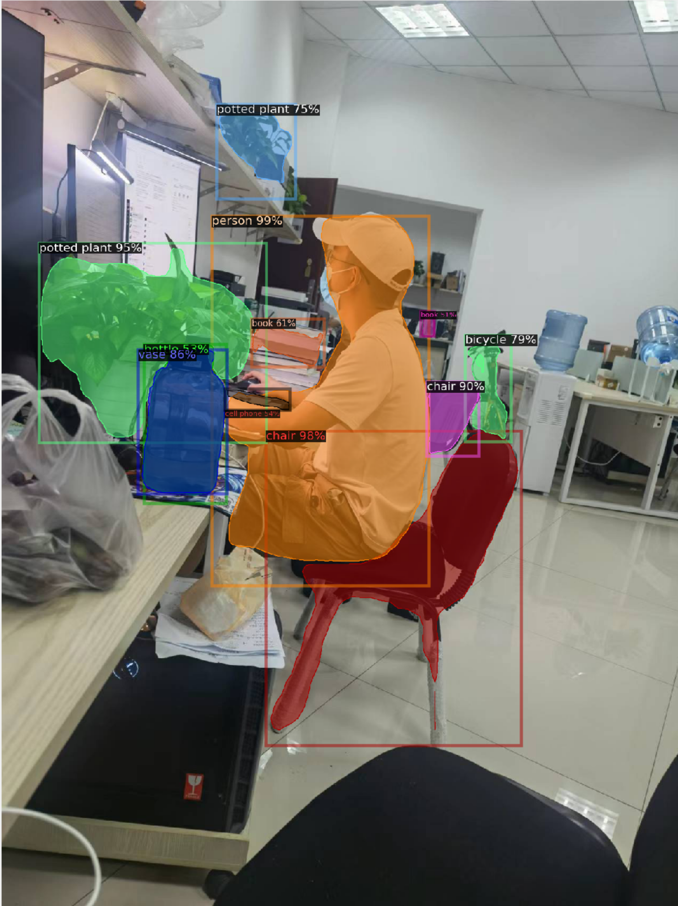

# Detectron2 学习记录

## 目录

1. 总述
2. Detectron2的运行机制
3. 数据集构造和数据加载
4. 模型的搭建
5. 模型的训练和预测
6. 日志文件保存、可视化结果等善后操作
7. 一个完整的项目代码讲解
8. 如何实现一个自己的项目

## 1、总述

近些年来，计算机视觉在深度学习的加持下，无论是在学术界还是工业界都异常火爆。俗话说“工欲善其事必先利其器”，一个简单上手、
功能强大的深度学习框架对于程序猿而言非常关键，今天分享的是Facebook（哈哈哈，现在改成Meta了）开发的检测分割的框架——Detectron2，
有一说一，这个框架在抽象性、适用性、扩展性等方面都有很多亮眼的地方，这段时间看了它的官方文档和源码，感觉大脑一片混乱，就很碎片化，
必须得好好总结一下，方便自己以后的梳理，官方[GitHub地址](https://github.com/facebookresearch/detectron2)。

写下此文只为了自己的知识梳理，其中有大量复制粘贴操作，如有侵权，立马下架。本文主要参考了[https://www.zhihu.com/column/c_1167741072251305984](https://www.zhihu.com/column/c_1167741072251305984)
以小样本目标检测的论文DeFRCN的开源代码为样例，[开源代码地址](https://github.com/er-muyue/DeFRCN)

<center>

</center>
<center>
Figure2_1: 官方demo
</center>
&nbsp

<center>


</center>
<p align="center">Figure2_2: 努力奋斗的小邓 </p>
&nbsp

写过深度学习代码的小伙伴应该不陌生，一个完整的深度网络的学习过程至少包含四个核心的过程：（1）数据集（dataset)的构建和数据加载（dataloader）
、（2）模型（model）的构建、（3）对于模型进行训练（train）和预测（inference）、（4）进行日志文件保存、可视化结果等善后操作。
因而本文主要从这四个方向进行展开，试图对detectron2 “窥一斑而见全豹”，尽量展现出她那楚楚动人的全貌。
整个系列包括以下内容：
1. 数据集构造和数据加载
2. 模型的搭建
3. 模型的训练和预测
4. 日志文件保存、可视化结果等善后操作
5. 一个完整的项目代码讲解
6. 如何实现一个自己的项目（以few shot object detection为例）

立文于此，希望自己可以坚持下去，更新完毕。

## 2、Detectron2的运行机制
对于开发一个好用的框架而言，最重要的是能够对整个运行过程进行合理的抽象，提炼出最核心的部分进行格式化集成，从而既保证用户可以简单易上手，
不用关心那些繁琐的细枝末节，同时又要尽量保证框架的通用性和扩展性，不能只拘泥于某些特定的场景。那么接下来我们一起来看一下detectron2的运行机制。
1. 全局变量机制
2. 注册机制
3. Hook机制

### 全局变量机制
有过编程经验的小伙伴一定知道，我们习惯性地把一些频繁使用的常量定义为全局变量，这样既会增加整体代码的可读性，又很方便我们对代码的修改调试，
当我们需要对代码或者组件进行重新组合时，只需要简单的修改全局变量即可，不用对代码进行大规模的修改，而对于整个网络模型的搭建训练过程，
能不能也采用全局变量呢？答案是肯定的。 detectron2为全局变量定义与修改提供了4个接口位置：

  + 框架默认的全局变量detectron2/config/defaults
  + 用户自定义的项目默认的全局变量project/config/defaults
  + 自定义的configs(yaml文件)
  + 命令行的输入

如果这4个位置都对同一变量进行了不同的定义，那么这个变量在最终运行时该是那个位置定义的呢？detectron2对4个位置的优先级进行了规定：
###### <center>框架默认<项目默认<自定义的configs<命令行

上述优先级是由于数据的加载顺序决定的，detectron2首先加载框架的默认参数，然后再加载项目的默认参数修改和覆盖框架默认的参数，接着从.yaml文件里面读取，
最后是命令行。下面是detectron2读取参数的过程：

```python
def setup(args):
    cfg = get_cfg()    #从框架默认detectron2/config/defaults和项目默认project/config/defaults读取参数
    cfg.merge_from_file(args.config_file)   #从configs(.yaml文件)里读取
    if args.opts:           
        cfg.merge_from_list(args.opts) # 从命令行里面读取
    cfg.freeze()  #将参数固定，不再修改
    set_global_cfg(cfg)   #通过读取的参数设置全局变量
    default_setup(cfg, args)  #通过读取的参数设置默认变量
    return cfg   
```
以后所有需要用到全局变量的地方都可以通过setup返回的cfg来获取，例如：
```python
@META_ARCH_REGISTRY.register()
class GeneralizedRCNN(nn.Module):

    def __init__(self, cfg):
        super().__init__()

        self.cfg = cfg
        self.device = torch.device(cfg.MODEL.DEVICE)
        self.backbone = build_backbone(cfg)
        self._SHAPE_ = self.backbone.output_shape()
        self.proposal_generator = build_proposal_generator(cfg, self._SHAPE_)
        self.roi_heads = build_roi_heads(cfg, self._SHAPE_)
        self.normalizer = self.normalize_fn()
        self.affine_rpn = AffineLayer(num_channels=self._SHAPE_['res4'].channels, bias=True)
        self.affine_rcnn = AffineLayer(num_channels=self._SHAPE_['res4'].channels, bias=True)
        self.to(self.device)

        if cfg.MODEL.BACKBONE.FREEZE:
            for p in self.backbone.parameters():
                p.requires_grad = False
            print("froze backbone parameters")

        if cfg.MODEL.RPN.FREEZE:
            for p in self.proposal_generator.parameters():
                p.requires_grad = False
            print("froze proposal generator parameters")

        if cfg.MODEL.ROI_HEADS.FREEZE_FEAT:
            for p in self.roi_heads.res5.parameters():
                p.requires_grad = False
            print("froze roi_box_head parameters")
```
而在项目默认project/config/defaults中有：
```python
from detectron2.config.defaults import _C

_CC = _C

# ----------- Backbone ----------- #
_CC.MODEL.BACKBONE.FREEZE = False
_CC.MODEL.BACKBONE.FREEZE_AT = 3

# ------------- RPN -------------- #
_CC.MODEL.RPN.FREEZE = False
_CC.MODEL.RPN.ENABLE_DECOUPLE = False
_CC.MODEL.RPN.BACKWARD_SCALE = 1.0

# ------------- ROI -------------- #
_CC.MODEL.ROI_HEADS.NAME = "Res5ROIHeads"
_CC.MODEL.ROI_HEADS.FREEZE_FEAT = False
_CC.MODEL.ROI_HEADS.ENABLE_DECOUPLE = False
_CC.MODEL.ROI_HEADS.BACKWARD_SCALE = 1.0
_CC.MODEL.ROI_HEADS.OUTPUT_LAYER = "FastRCNNOutputLayers"
_CC.MODEL.ROI_HEADS.CLS_DROPOUT = False
_CC.MODEL.ROI_HEADS.NUM_CLASSES_NOVEL = 5
_CC.MODEL.ROI_HEADS.DROPOUT_RATIO = 0.8
_CC.MODEL.ROI_BOX_HEAD.POOLER_RESOLUTION = 7  # for faster
_CC.MODEL.ROI_HEADS.MODEL_WEIGHTS_BASE_PATH = "/home/yxd/document/test/DeFRCN/checkpoints/voc/defrcn/defrcn_det_r101_base1/model_final.pth"
_CC.MODEL.ROI_HEADS.MODEL_WEIGHTS_FINETUNE_PATH = "/home/yxd/document/AI1/DeFRCN/checkpoints/voc/defrcn_test1/defrcn_det_r101_loadweight1/weight_classifier.pth"
_CC.MODEL.ROI_HEADS.PREDICTOR_BIAS = True
_CC.MODEL.ROI_HEADS.FREEZE = False
_CC.MODEL.ROI_HEADS.MODE_SETTING = 'fsod'
_CC.MODEL.ROI_HEADS.MODEL_SURGERY_METHOD = 'randinit'

# ------------- TEST ------------- #
_CC.TEST.PCB_ENABLE = False
_CC.TEST.PCB_MODELTYPE = 'resnet'             # res-like
_CC.TEST.PCB_MODELPATH = ""
_CC.TEST.PCB_ALPHA = 0.50
_CC.TEST.PCB_UPPER = 1.0
_CC.TEST.PCB_LOWER = 0.05

# ------------ Other ------------- #
_CC.SOLVER.WEIGHT_DECAY = 5e-5
_CC.MUTE_HEADER = True
```
这样就可以通过cfg就能获取全局变量_CC.MODEL.RPN.FREEZE等参数了。
<p>
&nbsp
</p>


#### 框架默认detectron2/config/defaults
detectron2为了减轻用户构造模型的复杂度，集成了很多模型或者组件，它可以通过框架默认设置构造出对应的模型，用户在建立自己的项目时，
只需要在项目默认project/config/defaults中，写下与默认的设置不同的内容,框架默认的设置详见project/config/defaults，部分内容如下：
```python
# Copyright (c) Facebook, Inc. and its affiliates.
from .config import CfgNode as CN

# -----------------------------------------------------------------------------
# Convention about Training / Test specific parameters
# -----------------------------------------------------------------------------
# Whenever an argument can be either used for training or for testing, the
# corresponding name will be post-fixed by a _TRAIN for a training parameter,
# or _TEST for a test-specific parameter.
# For example, the number of images during training will be
# IMAGES_PER_BATCH_TRAIN, while the number of images for testing will be
# IMAGES_PER_BATCH_TEST

# -----------------------------------------------------------------------------
# Config definition
# -----------------------------------------------------------------------------

_C = CN()

# The version number, to upgrade from old configs to new ones if any
# changes happen. It's recommended to keep a VERSION in your config file.
_C.VERSION = 2

_C.MODEL = CN()
_C.MODEL.LOAD_PROPOSALS = False
_C.MODEL.MASK_ON = False
_C.MODEL.KEYPOINT_ON = False
_C.MODEL.DEVICE = "cuda"
_C.MODEL.META_ARCHITECTURE = "GeneralizedRCNN"

# Path (a file path, or URL like detectron2://.., https://..) to a checkpoint file
# to be loaded to the model. You can find available models in the model zoo.
_C.MODEL.WEIGHTS = ""

# Values to be used for image normalization (BGR order, since INPUT.FORMAT defaults to BGR).
# To train on images of different number of channels, just set different mean & std.
# Default values are the mean pixel value from ImageNet: [103.53, 116.28, 123.675]
_C.MODEL.PIXEL_MEAN = [103.530, 116.280, 123.675]
# When using pre-trained models in Detectron1 or any MSRA models,
# std has been absorbed into its conv1 weights, so the std needs to be set 1.
# Otherwise, you can use [57.375, 57.120, 58.395] (ImageNet std)
_C.MODEL.PIXEL_STD = [1.0, 1.0, 1.0]
```
<p>
&nbsp
</p>


#### 项目默认project/config/defaults
项目默认的设置是针对用户具体的项目而设定的，通常涉及到用户自己的模型结构、训练、测试和输入输出等具体的过程。例如：
```python
from detectron2.config.defaults import _C
from detectron2.config import CfgNode as CN

_CC = _C

# ----------- Backbone ----------- #
_CC.MODEL.BACKBONE.FREEZE = False
_CC.MODEL.BACKBONE.FREEZE_AT = 3

# ------------- RPN -------------- #
_CC.MODEL.RPN.FREEZE = False
_CC.MODEL.RPN.ENABLE_DECOUPLE = False
_CC.MODEL.RPN.BACKWARD_SCALE = 1.0

# ------------- ROI -------------- #
_CC.MODEL.ROI_HEADS.NAME = "Res5ROIHeads"
_CC.MODEL.ROI_HEADS.FREEZE_FEAT = False
_CC.MODEL.ROI_HEADS.ENABLE_DECOUPLE = False
_CC.MODEL.ROI_HEADS.BACKWARD_SCALE = 1.0
_CC.MODEL.ROI_HEADS.OUTPUT_LAYER = "FastRCNNOutputLayers"
_CC.MODEL.ROI_HEADS.CLS_DROPOUT = False
_CC.MODEL.ROI_HEADS.NUM_CLASSES_NOVEL = 5
_CC.MODEL.ROI_HEADS.DROPOUT_RATIO = 0.8
_CC.MODEL.ROI_BOX_HEAD.POOLER_RESOLUTION = 7  # for faster
_CC.MODEL.ROI_HEADS.MODEL_WEIGHTS_BASE_PATH = "/home/yxd/document/test/DeFRCN/checkpoints/voc/defrcn/defrcn_det_r101_base1/model_final.pth"
_CC.MODEL.ROI_HEADS.MODEL_WEIGHTS_FINETUNE_PATH = "/home/yxd/document/AI1/DeFRCN/checkpoints/voc/defrcn_test1/defrcn_det_r101_loadweight1/weight_classifier.pth"
_CC.MODEL.ROI_HEADS.PREDICTOR_BIAS = True
_CC.MODEL.ROI_HEADS.FREEZE = False
_CC.MODEL.ROI_HEADS.MODE_SETTING = 'fsod'
_CC.MODEL.ROI_HEADS.MODEL_SURGERY_METHOD = 'randinit'

# ------------- TEST ------------- #
_CC.TEST.PCB_ENABLE = False
_CC.TEST.PCB_MODELTYPE = 'resnet'             # res-like
_CC.TEST.PCB_MODELPATH = ""
_CC.TEST.PCB_ALPHA = 0.50
_CC.TEST.PCB_UPPER = 1.0
_CC.TEST.PCB_LOWER = 0.05

# ------------ Other ------------- #
_CC.SOLVER.WEIGHT_DECAY = 5e-5
_CC.MUTE_HEADER = True
```
<p>
&nbsp
</p>

#### configs自定义
对于目前几乎所有领域的论文实验的benchmark，都要要求对同一个模型在不同的数据集运行多次，而在每一次的运行过程中，模型的设定都不一样，
如果每次运行的时候我们都手动地去修改它，就会显得很麻烦，而且很容易出错。detectron2针对每一次的运行给我们提供了一个很方便的接口：
.yaml文件，我们可以针对每一次不同的运行过程应用不同的.yaml文件来指定不同的设置。甚至我们可以写一个脚本文件，一口气生成所有用到的
.yaml文件，这样就可以把繁琐的参数修改过程进一步抽象化和自动化。例如：
```python
VERSION: 2
MODEL:
  META_ARCHITECTURE: "GeneralizedRCNN"
  RPN:
    PRE_NMS_TOPK_TEST: 6000
    POST_NMS_TOPK_TEST: 1000
  ROI_HEADS:
    NAME: "Res5ROIHeads"
DATASETS:
  TRAIN: ("coco_2017_train",)
  TEST: ("coco_2017_val",)
SOLVER:
  IMS_PER_BATCH: 16
  BASE_LR: 0.02
  STEPS: (60000, 80000)
  MAX_ITER: 90000
INPUT:
  MIN_SIZE_TRAIN: (640, 672, 704, 736, 768, 800)
```
<p>
&nbsp
</p>


#### 命令行输入
绝大部分我们的实验都是在服务器上跑的，这就不可避免的要使用linux命令了，而detection2为模型全局变量的设置也提供了命令行的接口，
detectron2对命令行的输入是通过Python的argparse模块来获取的，下面是读取命令行的一个示例：

```python
import argparse
import os
def default_argument_parser():
    """
    Create a parser with some common arguments used by DeFRCN users.

    Returns:
        argparse.ArgumentParser:
    """
    parser = argparse.ArgumentParser(description="DeFRCN Training")
    parser.add_argument("--config-file", default="", metavar="FILE",
                        help="path to config file")
    parser.add_argument("--resume", action="store_true",
                        help="whether to attempt to resume")
    parser.add_argument("--eval-only", action="store_true",
                        help="evaluate last checkpoint")
    parser.add_argument("--eval-all", action="store_true",
                        help="evaluate all saved checkpoints")
    parser.add_argument("--eval-during-train", action="store_true",
                        help="evaluate during training")
    parser.add_argument("--eval-iter", type=int, default=-1,
                        help="checkpoint iteration for evaluation")
    parser.add_argument("--start-iter", type=int, default=-1,
                        help="starting iteration for evaluation")
    parser.add_argument("--end-iter", type=int, default=-1,
                        help="ending iteration for evaluation")
    parser.add_argument("--num-gpus", type=int, default=1,
                        help="number of gpus *per machine*")
    parser.add_argument("--num-machines", type=int, default=1)
    parser.add_argument("--machine-rank", type=int, default=0,
                        help="the rank of this machine")

    # PyTorch still may leave orphan processes in multi-gpu training.
    # Therefore we use a deterministic way to obtain port,
    # so that users are aware of orphan processes by seeing the port occupied.
    port = 2 ** 15 + 2 ** 14 + hash(os.getuid()) % 2 ** 14
    parser.add_argument("--dist-url", default="tcp://127.0.0.1:{}".format(port))
    parser.add_argument("--opts", default=None, nargs=argparse.REMAINDER,
                        help="Modify config options using the command-line")
    
    return parser
```
我们在运行时，只需要用cmd在项目路径下输入：
```python
python3 main.py --num-gpus 4 --config-file configs/coco/defrcn_det_r101_base.yaml     \
    --opts MODEL.WEIGHTS ${IMAGENET_PRETRAIN}                                         \
           OUTPUT_DIR ${SAVEDIR}/defrcn_det_r101_base
```
甚至我们可以写一个.sh脚本：
```python
EXP_NAME=$1
SAVE_DIR=checkpoints/voc/${EXP_NAME}
IMAGENET_PRETRAIN=/home/yxd/document/test/DeFRCN/data/.pretrain_weights/ImageNetPretrained/MSRA/R-101.pkl                            # <-- change it to you path
IMAGENET_PRETRAIN_TORCH=/home/yxd/document/test/DeFRCN/data/.pretrain_weights/ImageNetPretrained/torchvision/resnet101-5d3b4d8f.pth  # <-- change it to you path
SPLIT_ID=$2


# ------------------------------- Base Pre-train ---------------------------------- #
python3 main.py --num-gpus 4 --config-file configs/voc/defrcn_det_r101_base${SPLIT_ID}.yaml     \
    --opts MODEL.WEIGHTS ${IMAGENET_PRETRAIN}                                                   \
           OUTPUT_DIR ${SAVE_DIR}/defrcn_det_r101_base${SPLIT_ID}


# ------------------------------ Model Preparation -------------------------------- #
python3 tools/model_surgery.py --dataset voc --method remove                                    \
    --src-path ${SAVE_DIR}/defrcn_det_r101_base${SPLIT_ID}/model_final.pth                      \
    --save-dir ${SAVE_DIR}/defrcn_det_r101_base${SPLIT_ID}
BASE_WEIGHT=${SAVE_DIR}/defrcn_det_r101_base${SPLIT_ID}/model_reset_remove.pth

# ------------------------------ Novel Fine-tuning -------------------------------- #
# --> 1. FSRW-like, i.e. run seed0 10 times (the FSOD results on voc in most papers)
for repeat_id in 0 1 2 3 4 5 6 7 8 9
do
    for shot in 1 2 3 5 10   # if final, 10 -> 1 2 3 5 10
    do
        for seed in 0
        do
            python3 tools/create_config.py --dataset voc --config_root configs/voc \
                --shot ${shot} --seed ${seed} --setting 'fsod' --split ${SPLIT_ID}
            CONFIG_PATH=configs/voc/defrcn_fsod_r101_novel${SPLIT_ID}_${shot}shot_seed${seed}.yaml
            OUTPUT_DIR=${SAVE_DIR}/defrcn_fsod_r101_novel${SPLIT_ID}/fsrw-like/${shot}shot_seed${seed}_repeat${repeat_id}
            python3 main.py --num-gpus 4 --config-file ${CONFIG_PATH}                          \
                --opts MODEL.WEIGHTS ${BASE_WEIGHT} OUTPUT_DIR ${OUTPUT_DIR}                   \
                       TEST.PCB_MODELPATH ${IMAGENET_PRETRAIN_TORCH}
            rm ${CONFIG_PATH}
            rm ${OUTPUT_DIR}/model_final.pth
        done
    done
done
python3 tools/extract_results.py --res-dir ${SAVE_DIR}/defrcn_fsod_r101_novel${SPLIT_ID}/fsrw-like --shot-list 1 2 3 5 10  # surmarize all results


# ----------------------------- Model Preparation --------------------------------- #
python3 tools/model_surgery.py --dataset voc --method randinit                                \
    --src-path ${SAVE_DIR}/defrcn_det_r101_base${SPLIT_ID}/model_final.pth                    \
    --save-dir ${SAVE_DIR}/defrcn_det_r101_base${SPLIT_ID}
BASE_WEIGHT=${SAVE_DIR}/defrcn_det_r101_base${SPLIT_ID}/model_reset_surgery.pth
```
通过bash的命令来执行，从而使得模型的运行更加自动化。
<p>
&nbsp
</p>

我们刚刚讲完了全局变量的获取，知道detectron2可以通过全局变量来调用和构造特定的模型，使用特定的数据集，执行特定的训练过程，
但是它是如何完成这样神奇的操作的呢？例如，我们在全局变量中的设定：
```python
MODEL:
  META_ARCHITECTURE: "GeneralizedRCNN"
  RPN:
    PRE_NMS_TOPK_TEST: 6000
    POST_NMS_TOPK_TEST: 1000
  ROI_HEADS:
    NAME: "Res5ROIHeads"
DATASETS:
  TRAIN: ("coco_2017_train",)
  TEST: ("coco_2017_val",)
```
其中诸如：META_ARCHITECTURE: "GeneralizedRCNN"，我们并没有显示的给出具体的参数（如backbone的结构、卷积核的大小、输入图像的尺寸等），
它是怎么帮我们自动构建出这样复杂的模型的呢？如果是框架集成了这些模型具体实现的代码，那么我们可以加入自己的组件吗？

为了回答回答这个问题，我们就引出了注册机制Registry。

<p>
&nbsp
</p>

### 注册机制
对于不同的深度学习项目，一般都会采用不同的数据集和不同的model。 detectron2为了保证适用性和通用性，对数据集（dataset）和模型（model）模块进行了合理的抽象，
提供Registry机制作为API，供用户根据特定的场景用自己的数据训练自己的模型。下面是detectron2的Registry机制的具体代码：

```python
class Registry(Iterable[Tuple[str, Any]]):
    """
    The registry that provides name -> object mapping, to support third-party users' custom modules.
    """

    def __init__(self, name: str) -> None:
        """
        Args:
            name (str): the name of this registry
        """
        self._name: str = name
        self._obj_map: Dict[str, Any] = {}

    def _do_register(self, name: str, obj: Any) -> None:
        assert (
            name not in self._obj_map
        ), "An object named '{}' was already registered in '{}' registry!".format(
            name, self._name
        )
        self._obj_map[name] = obj

    def register(self, obj: Any = None) -> Any:
        """
        Register the given object under the the name `obj.__name__`.Can be used as either a decorator or not. 
        """
        if obj is None:
            # used as a decorator
            def deco(func_or_class: Any) -> Any:
                name = func_or_class.__name__
                self._do_register(name, func_or_class)
                return func_or_class

            return deco

        # used as a function call
        name = obj.__name__
        self._do_register(name, obj)

    def get(self, name: str) -> Any:
        ret = self._obj_map.get(name)
        if ret is None:
            raise KeyError(
                "No object named '{}' found in '{}' registry!".format(name, self._name)
            )
        return ret
```

Register机制以类的方式定义，类内有两个分量_name和_obj_map，在init过程中需要传入_name参数，用于定义需要注册的dataset或model的名称，
_obj_map是一个字典，用于实现从name到obj的映射。

Register有两个核心的成员函数register和get，register的作用就是在字典_obj_map中存入要注册的dataset或model，它通常有两种调用方式：
作为普通函数调用和作为装饰器调用，具体调与用方式参见一下代码：
```python
BACKBONE_REGISTRY = Registry('BACKBONE')
@BACKBONE_REGISTRY.register()  #装饰器调用
class MyBackbone():
    ...
```
上面的装饰器调用等价于以下的代码：

```python
BACKBONE_REGISTRY = Registry('BACKBONE')
class MyBackbone():
    ...
BACKBONE_REGISTRY.register(MyBackbone)
```

#### [补充]装饰器
装饰器本质上是一个Python函数(其实就是闭包)，它可以让其他函数在不需要做任何代码变动的前提下增加额外功能，装饰器的返回值也是一个函数对象。
装饰器用于有以下场景，比如:插入日志、性能测试、事务处理、缓存、权限校验等场景。

例如给函数加上加上计数功能：
```python
import time
 
def how_much_time(func):
    def inner():
        t_start = time.time()
        func()
        t_end = time.time()
        print("一共思考了{0}秒时间".format(t_end - t_start, ))
    return inner
    # 将增加的新功能代码以及被装饰函数运行代码func()一同打包返回，返回的是一个内部函数，这个被返回的函数就是装饰器

@how_much_time
# @how_much_time等价于sleep_5s = how_much_time(sleep_5s)
def who_is_the_most_handsome_in_552():
    print("")
    time.sleep(5)
    print("这还用说，当然是yxd了！！" )

who_is_the_most_handsome_in_552()


'''
输出结果：
这得让我思考一会：
这还用说，当然是yxd了！！
一共思考了5.001260161399841秒时间
'''
```
通过@形式使用装饰器，会在使用被装饰对象的的同时自动调用装饰器函数。

<p>
&nbsp
</p>


下面举三个具体的例子来看一下Register的使用方式：
```python
# 函数的注册
registry_machine = Registry('registry_machine')

@registry_machine.register()
def print_hello_world(word):
    print('hello {}'.format(word))
@registry_machine.register()
def print_hi_world(word):
    print('hi {}'.format(word))

if __name__ == '__main__':

    cfg1 = 'print_hello_world'
    cfg2 = 'print_hi_world'
    
    registry_machine.get(cfg1)('world')
    registry_machine.get(cfg2)('world')
    
    print(registry_machine._obj_map)
    
    
    
'''

输出结果：
hello world
hi world
{'print_hello_world': <function print_hello_world at 0x7f3613f85320>, 
'print_hi_world': <function print_hi_world at 0x7f3613f85f80>}

'''
```


```python
#数据集dataset的注册
def my_dataset_function():
  ...
  return list[dict] in the following format

from detectron2.data import DatasetCatalog
DatasetCatalog.register("my_dataset", my_dataset_function)
# later, to access the data:
data: List[Dict] = DatasetCatalog.get("my_dataset")
```
detectron2对dataset的标准接口是dataset输出的是List[Dict]，即一个字典的list，详细内容参见
3、数据集构建和数据加载。

```python
# model的注册
@BACKBONE_REGISTRY.register()
class Backbone(nn.Module, metaclass=ABCMeta):
    """
    Abstract base class for network backbones.
    """

    def __init__(self):
        """
        The `__init__` method of any subclass can specify its own set of arguments.
        """
        super().__init__()

    @abstractmethod
    def forward(self):
        """
        Subclasses must override this method, but adhere to the same return type.

        Returns:
            dict[str->Tensor]: mapping from feature name (e.g., "res2") to tensor
        """
        pass

    @property
    def size_divisibility(self) -> int:
        """
        Some backbones require the input height and width to be divisible by a
        specific integer. This is typically true for encoder / decoder type networks
        with lateral connection (e.g., FPN) for which feature maps need to match
        dimension in the "bottom up" and "top down" paths. Set to 0 if no specific
        input size divisibility is required.
        """
        return 0

    @property
    def padding_constraints(self) -> Dict[str, int]:
        """
        This property is a generalization of size_divisibility. Some backbones and training
        recipes require specific padding constraints, such as enforcing divisibility by a specific
        integer (e.g., FPN) or padding to a square (e.g., ViTDet with large-scale jitter
        in :paper:vitdet). `padding_constraints` contains these optional items like:
        {
            "size_divisibility": int,
            "square_size": int,
            # Future options are possible
        }
        `size_divisibility` will read from here if presented and `square_size` indicates the
        square padding size if `square_size` > 0.

        TODO: use type of Dict[str, int] to avoid torchscipt issues. The type of padding_constraints
        could be generalized as TypedDict (Python 3.8+) to support more types in the future.
        """
        return {}

    def output_shape(self):
        """
        Returns:
            dict[str->ShapeSpec]
        """
        # this is a backward-compatible default
        return {
            name: ShapeSpec(
                channels=self._out_feature_channels[name], stride=self._out_feature_strides[name]
            )
            for name in self._out_features
        }
```
上述注册的backbone的代码来自于Detectron2对backbone类的定义，通过装饰器对该model进行注册。

通过装饰器机制我们会发现，当我们定义了模型、组件、数据集加载函数，在把它们进行实例化时，就自动调用了注册机制，自动对model、dataset等进行了注册，
这样当我们从全局变量cfg中取出模型的名字，如“GeneralizedRCNN”，调用Registry的get函数就可以得到已经注册的model或者dataset，
这样就实现了全局变量对模型的控制。
<p>
&nbsp
</p>

### HOOK机制
熟悉机器学习和深度学习的同学们肯定知道，一个深度学习模型的学习过程，通常有四个重要的过程：
+ 数据集的构建和数据流的加载
+ 模型的搭建
+ 模型的训练和预测
+ 计算结果的输出、日志文件的保存，可视化等善后操作


如何将这些繁杂的过程巧妙的组装起来，使得每个过程都很模块化，便于独立开发和组合使用。这就不得不提到一种很有趣的设计模式————HOOK机制
（钩子系统），下面我们来看一下detectron2是怎么使用HOOK机制的：

detectron2将所有模型的学习过程抽象为以下的步骤：
```python
    hook.before_train()
    for iter in range(start_iter, max_iter):
        hook.before_step()
        trainer.run_step()
        hook.after_step()
    iter += 1
    hook.after_train()
```
由上面的过程我们可以看出最主要的是hook和trainer，我们分别来看一下具体是如何实现的：

```python
class HookBase:
    """
    Notes:
        1. In the hook method, users can access ``self.trainer`` to access more
           properties about the context (e.g., model, current iteration, or config
           if using :class:`DefaultTrainer`).

        2. A hook that does something in :meth:`before_step` can often be
           implemented equivalently in :meth:`after_step`.
           If the hook takes non-trivial time, it is strongly recommended to
           implement the hook in :meth:`after_step` instead of :meth:`before_step`.
           The convention is that :meth:`before_step` should only take negligible time.

           Following this convention will allow hooks that do care about the difference
           between :meth:`before_step` and :meth:`after_step` (e.g., timer) to
           function properly.

    Attributes:
        trainer (TrainerBase): A weak reference to the trainer object. Set by the trainer
            when the hook is registered.
    """

    def before_train(self):
        """
        Called before the first iteration.
        """
        pass

    def after_train(self):
        """
        Called after the last iteration.
        """
        pass

    def before_step(self):
        """
        Called before each iteration.
        """
        pass

    def after_step(self):
        """
        Called after each iteration.
        """
        pass
```
hookbase是对模型的各个组件进行的抽象，例如dataloader、logger都可以继承hookbase，然后根据其特有的功能重写这4个方法。

```python
class TrainerBase:
    """
    Base class for iterative trainer with hooks.

    The only assumption we made here is: the training runs in a loop.
    A subclass can implement what the loop is.
    We made no assumptions about the existence of dataloader, optimizer, model, etc.

    Attributes:
        iter(int): the current iteration.

        start_iter(int): The iteration to start with.
            By convention the minimum possible value is 0.

        max_iter(int): The iteration to end training.

        storage(EventStorage): An EventStorage that's opened during the course of training.
    """

    def __init__(self):
        self._hooks = []

    def register_hooks(self, hooks):
        """
        Register hooks to the trainer. The hooks are executed in the order
        they are registered.

        Args:
            hooks (list[Optional[HookBase]]): list of hooks
        """
        hooks = [h for h in hooks if h is not None]
        for h in hooks:
            assert isinstance(h, HookBase)
            # To avoid circular reference, hooks and trainer cannot own each other.
            # This normally does not matter, but will cause memory leak if the
            # involved objects contain __del__:
            # See http://engineering.hearsaysocial.com/2013/06/16/circular-references-in-python/
            h.trainer = weakref.proxy(self)
        self._hooks.extend(hooks)

    def train(self, start_iter: int, max_iter: int):
        """
        Args:
            start_iter, max_iter (int): See docs above
        """
        logger = logging.getLogger(__name__)
        logger.info("Starting training from iteration {}".format(start_iter))

        self.iter = self.start_iter = start_iter
        self.max_iter = max_iter

        with EventStorage(start_iter) as self.storage:
            try:
                self.before_train()
                for self.iter in range(start_iter, max_iter):
                    self.before_step()
                    self.run_step()
                    self.after_step()
                # self.iter == max_iter can be used by `after_train` to
                # tell whether the training successfully finished or failed
                # due to exceptions.
                self.iter += 1
            except Exception:
                logger.exception("Exception during training:")
                raise
            finally:
                self.after_train()

    def before_train(self):
        for h in self._hooks:
            h.before_train()

    def after_train(self):
        self.storage.iter = self.iter
        for h in self._hooks:
            h.after_train()

    def before_step(self):
        # Maintain the invariant that storage.iter == trainer.iter
        # for the entire execution of each step
        self.storage.iter = self.iter

        for h in self._hooks:
            h.before_step()

    def after_step(self):
        for h in self._hooks:
            h.after_step()

    def run_step(self):
        raise NotImplementedError
```
trainer是对整个训练过程的抽象，通过维护self._hooks队列，将不同hook组件放到该队列里，然后在恰当的时机调用队列中所有hook组件的4个方法函数。
如果想对hook机制做进一步了解，请参见5、模型的训练和预测。
<p>
&nbsp
</p>


## 3、数据集构建和数据加载
本节分为以下内容：
+ 如何设计一个数据加载模块
+ dataloader 相关代码介绍
+ 如何加载自己的数据集


### 如何设计一个数据加载模块

#### 1.如何设计一个最简单的 dataset

我们知道，在pytorch中，一个dataset 应该需要包含3个函数：
```python
class MyDataset():
    def __init__(self):
        ....
    def __len__(self):
        # 返回dataset 中一共有多少数据量
    def __getitem__(self, idx):
        # 输入参数为 样本编号 idx
        # 返回模型训练所需的第idx个样本的信息
```
注意到， 这里每个idx，应该对应的是一张图，而不是一个检测框。在目标检测任务中，一张图上会对应着多个框。而在这里，样本是以图为单位的，而不是以框为单位的

那么我们将从这个最简单的dataset开始，一步一步的把他变复杂，变成和detectron2中设计的dataset相近的东西

#### 2.设计__getitem__模块中返回内容的细节
对应上文说，每个样本是一张图的观点，在 __getitem__ 时，返回的样本信息应该是第idx张图片，以及第idx张图对应的所有的框，对应这种想法来说，
可以这样设计一个 __getitem__ 方法：
```python
def  __getitem__(self, idx):
     img : np.ndarray = load_image(idx)
     boxes : List[dict] = load_boxes(idx)
     return img ,boxes
```
加载的图片一般会使用 cv2 或者 Pillow ， 加载完成的图片当然是一个ndarray或者tensor，而boxes信息，因为是多个框，当然可以使用一个list来存储框的信息，
而每个检测框之所以设计成字典，是因为目标检测中有许多的任务，一个框中可能除了包含bbox信息，还包含了segmentation等其它的信息，就像下面这个样子:
```python
# boxes[0]
{"boxes" : ... , "segmentation": ...}
```
至此，你可以设计出如下的代码：
```python
image_anno_info = 
[
 {"image_id":xxx,
  "image_height":xxx,
  "image_width" : xxx,
  "annotations": [
     {"boxes": xxx , "segmentations": xxx},
     {"boxes": xxx , "segmentations": xxx}
     ...
  ]
  },
...
]

class MyDataset():
    def __init__(self , image_and_anno):
        self.image_and_anno = image_and_anno
    def __len__(self):
        # 返回dataset 中一共有多少数据量
    def __getitem__(self,idx):
        # 输入参数为 样本编号 idx
        # 返回模型训练所需的第idx个样本的信息
        sample = self.image_and_anno[idx]
        image = read_image(sample['image_id'])
        anno = sample['annotations']
        return image , anno
```
注意到这里，代码变成了两个部分：

1、 第一部分为数据的加载，通过某种加载方式，获得了image_anno_info，每个元素为一个图片的信息和图片对应的标注信息

2、 第二部分为利用图片的各种信息，在 __getitem__ 中完成图片的读取和annotation的加载，进而成功了创建dataset

<p>&nbsp;</p>

#### 3.加入数据增强
在构造__getitem__时，不仅需要加载图片和annotation ，很多时候还需要完成数据增强的过程。

为了提升训练的效果，一般在每次训练的时候，我们都加入数据增强的操作，因此，也许你可以这么设计你的dataset：
```python
class MyDataset():
    def __init__(self , image_and_anno , aug_args):
        self.image_and_anno = image_and_anno
        self.augmentation_gen = build_augmentation_gen(aug_args)
    def __len__(self):
        # 返回dataset 中一共有多少数据量
    def __getitem__(self,idx):
        # 输入参数为 样本编号 idx
        # 返回模型训练所需的第idx个样本的信息
        sample = self.image_and_anno[idx]
        image = read_image(sample['image_id'])
        anno = sample['annotations']

        # 开始做数据增强
        augmentation = self.augmentation_gen.gen_transform()
        image_trans = augmentation(image)
        anno_trans = augmentation(anno)      

        return image_trans , anno_trans
```
在这个阶段中，我们又做了两件事情：

1、 在dataset初始化中，建立了一个类self.augmentation_gen，这个类负责生成transform

2、 在 __getitem__ 中，我们首先利用这个transform生成了一个变换，然后基于这个变换，返回变换后的标签和图片
接下来，我们把代码重新整合一下：

```python
class MyDataset():
    def __init__(self, dataset , map_func):
        # 这里，我们把 图片读取、数据增强、标签整理等操作，放在这个叫map_func 中进行
        self.map_func = map_func
        # dataset 为一个list ，每个元素为一个dict ，对应一张图片的元数据，
        self._dataset = dataset
    def __len__(self):
        # 返回dataset 中一共有多少数据量
    def __getitem__(self,idx):
        idx_data = self._data[idx]
        data:dict = self.map_func(idx_data)
        return data # 返回一个字典，如 {"image" : torch.Tensor , "bboxes" : List[int] , ...}


class MapFunc():
    def __init__(self, cfg):
        self.transform_gens : List[TransformGen] = build_transform(cfg)
    def __call__(self,data_dict):

        # 读取图片
        image = read_image(data_dict['image_id'])
        annos = data_dict['annotation']

        image ,annos = self.apply_transform(image , annos)

        data_dict['annotations'] = annos
        data_dict['image'] = torch.as_tensor(image)

        return data_dict
    def apply_transform(self, image , annos):
        # 完成数据增强，对每一个数据增强操作，都完成三步：
        # 1 生成本轮用的数据增强
        # 2 对图片进行变换
        # 3 将生成的数据增强方法记录下来，作用在标签上
        tfms = []
        for g in self.transform_gens:
            tfm = g.get_transform(image)
            image = tfm.apply_image(image)
            tfms.append(tfm)
        tfms_anno = TransformList(tfms)
        
        annos = [tfms_anno(a) for a in annos]  
        return image , annos

if __name__ == "__main__":
    dataset = 
    [
     {"image_id":xxx,
      "annotations": [
         {"boxes": xxx , "segmentations": xxx},
         {"boxes": xxx , "segmentations": xxx}
         ...
      ]
      },
    ...
    ]

    map_func = MapFunc(cfg)
    mydataset = MyDataset(dataset , map_func)
```
注意到：

1、这里，将对数据的处理的操作封装在map_func中，则可以使得这个dataset类可以用于处理各种不同的任务，增加程序的稳定性

2、这里比较难理解的是关于数据增强的部分，关于这部分可以这么理解：

首先，在MapFunc 初始化的时候，定义的是一系列的“生成数据增强的函数”，用于在每次 获取数据的时候，随机生成一组参数，
用来生成一个特定的数据增强方法，一个最简单的数据增强生成器(TransformGen)是RandomFlip:
```python
class RandomFlip(TransformGen):
    """
    Flip the image horizontally or vertically with the given probability.
    """

    def __init__(self, prob=0.5, *, horizontal=True, vertical=False):
        """
        Args:
            prob (float): probability of flip.
            horizontal (boolean): whether to apply horizontal flipping
            vertical (boolean): whether to apply vertical flipping
        """
        super().__init__()

        if horizontal and vertical:
            raise ValueError("Cannot do both horiz and vert. Please use two Flip instead.")
        if not horizontal and not vertical:
            raise ValueError("At least one of horiz or vert has to be True!")
        self._init(locals())

    def get_transform(self, image):
        h, w = image.shape[:2]
        do = self._rand_range() < self.prob
        if do:
            if self.horizontal:
                return HFlipTransform(w)
            elif self.vertical:
                return VFlipTransform(h)
        else:
            return NoOpTransform()
```
可以看到，每个TransformGen函数会有一个 get_transform函数用于生成一个特定的数据增强函数

+ 其次，由于很多的数据增强方法可能会使用到图片的尺寸信息，所以会一边做get_transform，一边做 apply_image, 得到下一个阶段的图片，
+ 用于生成下一个阶段的transform
+ 另外，对每个transform方法，都需要实现如下的几个方法：

```python
class MyTransform(Transform):
    def apply_image(self, img, interp=None):
       ...
       return trans_image
    def apply_coords(self, coords):
       ...
       return trans_coords
    def apply_segmentation(self, segmentation):
       # 对语义分割的数据增强需要实现如下方法
       return trans_seg
```

#### 4.目前为止的框架图：


到目前为止，所有的内容可以总结为上面这张图：

1、通过某种方法 build_datasetlist ，获得数据的列表

2、设置一系列的TransformGen，生成一个用于数据处理MapFunc对象

3、在Mydataset 的 __getitem__方法中，利用map_func处理数据，获得最终的data_dict

目前为止，对map_func， 数据增强这两个模块都已经介绍完全了，
但是对于如何获取datasetList ,还没有进行详细的介绍，在接下来的内容中，我们将补全这部分的内容

<p>&emsp;</p>

#### 5.关于datasetList 的生成方法
首先来思考一下，detectron2在设计元数据加载的时候会遇到什么问题：

1、需要加载的数据类型多种多样，有coco，有voc

2、每种数据集类型下又有多个数据集，如coco2017，coco2014等等

3、每次进行训练时，可能需要使用多个数据集

针对这样的三个需求，detectron2对数据加载这部分内容，自下而上的，应该有如下的设计：

+ 首先对不同种类的数据集，应该定义不同的数据加载方法
如coco数据集，应该定义如下方法：
```python
def load_coco_json(json_file, image_root, dataset_name=None):
    data : List[dict] = ...
    return data
```
而在定义的过程中，需要注意一下两点：

返回的内容应该是一个List ，每个元素为一个dict，记录了每张图片的 annotation 信息， 图片的meta信息，如图片的路径等

定义的函数应该能够加载这个类型的各种数据集，如上面的这个函数，可以通过指定不同的dataset_name 来加载各种coco 数据集， 
如coco2017，coco2014等

+ 在设计好每个数据集的创建方法后，需要建立一个字典，来记录所有的数据集的对应的初始化方法，如下:
```python
coco2017_path = '...'
coco2014_path = '...'

datasetCatalog = {
   'coco2017' :  lambda: load_coco_json(coco2017_path , dataset_name = 'coco2017'),
   'coco2014' :  lambda: load_coco_json(coco2014_path , dataset_name = 'coco2014'),
}
```
这样，在训练时，只需要指明参数 ’coco2017‘ ， 则可以通过如下方法获得数据：
```python
cfg = 'coco2017'
datasetlist = datasetCatalog(cfg)()
```

+ 对于上面的加载多个数据集的问题，可以通过多次加载，然后拼接的方法
```python
import itertools

cfg1 = ’coco2017‘
cfg2 = ’coco2014‘

data_all = []
for cfg in [cfg1 , cfg2]:
    data_all.append(datasetCatalog(cfg)())
data_all =  list(itertools.chain.from_iterable(data_all))
```

#### 6.优化datasetCatalog的写法， 增加程序的扩展性

在上一个小节中，将datasetCatalog写成了字典，这样做的问题在于不具有很好的扩展性，当每个人希望定义自己的数据加载方法时都需要修改源代码中的这个字典。
在dataset 部分中，也可以将datasetCatalog设计成注册的形式：
```python
class DatasetCatalog(object):
    _REGISTERED = {}
    @staticmethod
    def register(name, func):
        DatasetCatalog._REGISTERED[name] = func

    @staticmethod
    def get(name):
     
        f = DatasetCatalog._REGISTERED[name]
        return f()
```
随后，在导入相关模块的时候，注册各个方法：
```python
def register_all_coco():
     for tag , tag_path in [['coco2017',path_2017] , ['coco2014',path_2014]]:
     DatasetCatalog.register(tag,lambda : load_coco(tag_path , tag))


register_all_coco()
```
这样就想所以的数据的加载方法存在在 DatasetCatalog中了
<p>&nbsp;</p>
#### 7.小结：完成的数据加载流程


综上所述，可以获得如上的完整的数据加载流程：

1、首先，对每种数据集，定义不同的数据加载函数，每个函数的返回值为一个List，每个元素为一个字典，对应一张图片和图片上的检测框信息，一般形式为:
```python
{
 "image_id": 用于查找图片和读取图片,
 "annotations" : [{"boxes": ..., "seg" : ...} , {"boxes": ... , "seg": ...} , ...] ,
 # 其他元信息
 ...
}
```
2、定义register()函数，如register_all_coco，在模块加载的时候执行，通过调用DatasetCatalog.register(name,func)的方法将读取数据的函数都注册到DatasetCatalog中

3、在面对实际的训练任务中提供的数据集名称dataset_name， 通过DatasetCatalog.get 方法获取数据， 并进一步包装成datasetList， 送入dataset 中

4、在数据加载之外，定义好一系列的Transform方法和TransformGen方法，并用于初始化一个MapFunc 数据处理对象，

5、利用MapFunc 方法和 datasetList，建立自己的数据集，从而完成数据的获取

<p>&nbsp;</p>

### dataloader 相关代码介绍

#### 1. 数据部分的代码结构
对应着上述内容，detectron2中相关的代码都设计在data目录下：

<center>

</center>

其中：

+ datasets主要负责定义各个数据集的具体的加载分析方法
+ sampler 负责dataloader 生成batch 数据时对dataset 的抽样方法
+ transforms 就负责记录所有的数据增强操作
+ build.py 负责 build_data_loader ,
+ catalog.py 中定义了 DatasetCatalog 和 MetaCatalog ， 后者用于对每个数据集记录元信息，如每个类别idx对应什么具体类别等
+ common.py 定义了MapDataset ， 即上文一直在说的MyDataset
+ dataset_mapper 中定义了MapFunc 类， 用于进行数据的增强和标签的处理

接下来将逐一讲解
<p>&nbsp;</p>

#### 2. detectron2 代码走读
这里以coco instance 检测数据集为例，介绍detectron2是如何完成数据的加载的

##### 2.1 **导入模块时，记录下读取数据集的方法到DataSetCatalog中**
目录结构及跳转大致如下：

<center>

</center>

在 data 目录的__init__.py 中可以看到
```python
# ensure the builtin datasets are registered
from . import datasets, samplers  # isort:skip
```
而在datasets的__init__.py中 有一句
```python
from . import builtin as _builtin  # ensure the builtin datasets are registered
```

而在builtin 模块中，会去注册加载coco数据集的方法：

```python
if __name__.endswith(".builtin"):
    # Assume pre-defined datasets live in `./datasets`.
    _root = os.path.expanduser(os.getenv("DETECTRON2_DATASETS", "datasets"))
    register_all_coco(_root)
    register_all_lvis(_root)
    register_all_cityscapes(_root)
    register_all_cityscapes_panoptic(_root)
    register_all_pascal_voc(_root)
    register_all_ade20k(_root)
```

函数register_all_coco 会在模块被导入的时候执行，函数中：
```python
def register_all_coco(root):
    for dataset_name, splits_per_dataset in _PREDEFINED_SPLITS_COCO.items():
        for key, (image_root, json_file) in splits_per_dataset.items():
            # Assume pre-defined datasets live in `./datasets`.
            register_coco_instances(
                key,
                _get_builtin_metadata(dataset_name),
                os.path.join(root, json_file) if "://" not in json_file else json_file,
                os.path.join(root, image_root),
            )
```
register_coco_instances 会把各个coco instance 数据集都做相应的注册，对应的注册方法也很简单：
```python
def register_coco_instances(name, metadata, json_file, image_root):
    DatasetCatalog.register(name, lambda: load_coco_json(json_file, image_root, name))
    MetadataCatalog.get(name).set(
        json_file=json_file, image_root=image_root, evaluator_type="coco", **metadata
    )
```

第一行，通过底层调用通用的load_coco_json方法，并封装成一个匿名函数注册进DatasetCatalog即可

而load_coco_json 的返回值大概如下：
```python
def load_coco_json(args):
    dataset_dicts = []
    # img_dict 是一个图片的元信息，  
    # anno_dict_list 是一个list， 每个元素为一个字典，对应一个检测框
    for (img_dict, anno_dict_list) in imgs_anns:
        record = {}
        # 记录图片的元信息
        record["file_name"] = os.path.join(image_root, img_dict["file_name"])
        record["height"] = img_dict["height"]
        record["width"] = img_dict["width"]
        image_id = record["image_id"] = img_dict["id"]

        objs = []
        for anno in anno_dict_list:
            obj = {"bbox":anno["bbox"] , ...}
            objs.append(obj)
        record['annotations'] = objs
        dataset_dicts.append(record)
```
结合Part1 的内容，不难理解上述数据加载的函数希望提供什么

第二行，这里定义了一个MetadataCatalog ， 本质就是存储关于数据集的元信息，比如每个类别id 对应的类别名称之类的，在数据创立时同时建立MetadataCatalog， 
可以为后面做infer 的时候，利用MetadataCatalog 来进行可视化啊，之类的，不多做介绍，具体内容可以看类的定义

##### 2.2 模型训练过程中的dataloader初始化
整个detectron2 基本的训练流程都定义在这个engine-defaults.py的DefaultTrainer当中：

<center>

</center>

```python
class DefaultTrainer(SimpleTrainer):
    def __init__(self ,cfg):
       ...
       dataloader = self.build_train_loader(cfg)
    def build_train_loader(self,cfg):
       return build_detection_train_loader(cfg)
```
对train后面会有详细的介绍，但是在这里，让我们首先来关注build_detection_train_loader 函数，在传入的参数cfg中，会指明需要建立的数据集的名称，
从而可以使用DatasetCatalog来建立数据集

##### 2.3 build_detection_train_loader 解析
这个函数，大体可以视为如下几个核心流程：
```python
def build_detection_train_loader(cfg):
    dataset_names = cfg.DATASETS.TRAIN # （'coco2017','coco2014'）
    # 根据我们对 DatasetCatalog.get 的理解， dataset_dicts 应该是一个 List[ List[dict]]
    dataset_dicts = [DatasetCatalog.get(dataset_name) \
                           for dataset_name in dataset_names]
    # chain.from_iterable : [[2,1,2],[3,2] , [1,2,1]] -> [2,1,2,3,2,1,2,1]
    # 转换为 List[dict] 形式
    dataset_dicts = list(itertools.chain.from_iterable(dataset_dicts))
    
    # 这里封装成DatasetFromList，和他自身原本的list形式没有太大区别
    # 只是取元素的时候支持deepcopy，即对取出的元素的修改不会修改原值
    dataset = DatasetFromList(dataset_dicts, copy=False)
   
    # DatasetMapper在data-dataset_mapper中定义，用于读取数据、数据增强，等操作
    mapper = DatasetMapper(cfg, True)
   
    # 构建dataset
    dataset = MapDataset(dataset, mapper)
 
    # 构建sampler
    batch_sampler = ...

    # 构建dataloader  
    data_loader = torch.utils.data.DataLoader(
        dataset,
        num_workers=cfg.DATALOADER.NUM_WORKERS,
        batch_sampler=batch_sampler,
        collate_fn=trivial_batch_collator,
        worker_init_fn=worker_init_reset_seed,
    )
```
关于DatasetCatalog，前面都有所介绍

而关于DatasetMapper、MapDataset（不做赘述） 其实也和前面介绍的相差无几：
```python
class DatasetMapper():
    def __init__(cfg):
        self.tfm_gens = utils.build_transform_gen(cfg, is_train)
    def __call__(dataset_dict):
        dataset_dict = copy.deepcopy(dataset_dict) 
        image = utils.read_image(dataset_dict["file_name"], format=self.img_format)
        image, transforms = T.apply_transform_gens(self.tfm_gens, image)
        
        dataset_dict["image"] = torch.as_tensor(image.transpose(2, 0, 1).astype("float32"))

        annos = [
                utils.transform_instance_annotations(
                    obj, transforms, image_shape for obj in dataset_dict.pop("annotations")
                ]
```
而在DatasetMapper 和前面的介绍中的一个细小的区别就是，detectron2中会使用Instance类来包装每一个检测框的信息，而不是简单的使用字典

<center>

</center>

因此，在后续自定数据集的时候，要注意把自己定义的数据变成一个Instance的形式才可以

在一般的检测类任务中会去读取 target.gt_boxes 和 target.gt_classes 来计算loss , 要特别注意.
<p>&nbsp;</p>


## 4、模型的搭建
在把全局变量放到配置文件里后，我们的模型应该如何搭建呢？不难想象，肯定要有一个接口，可以根据配置文件把我们想要的模型自动搭建出来，的确是这样，
detectron2提供了一个接口函数build_model(cfg)，cfg是我们前面讲的，是对配置的读取，而build_model可以通过cfg构建出我们需要的model。
这个神奇的过程是怎样实现的呢？我们一起来看一下。

本节分为以下部分：
+ 预训练权重的加载
+ detectron2.modeling走读

### 预训练权重的加载

<center>

</center>

如上图所示，detectron2.model_zoo模块是关于预训练模型加载的，当我们需要pretrained-model作为模型训练的起点时，我们可以在model_zoo.py中找到：
```python
class _ModelZooUrls(object):
    """
    Mapping from names to officially released Detectron2 pre-trained models.
    """

    S3_PREFIX = "https://dl.fbaipublicfiles.com/detectron2/"

    # format: {config_path.yaml} -> model_id/model_final_{commit}.pkl
    CONFIG_PATH_TO_URL_SUFFIX = {
        # COCO Detection with Faster R-CNN
        "COCO-Detection/faster_rcnn_R_50_C4_1x": "137257644/model_final_721ade.pkl",
        "COCO-Detection/faster_rcnn_R_50_DC5_1x": "137847829/model_final_51d356.pkl",
        "COCO-Detection/faster_rcnn_R_50_FPN_1x": "137257794/model_final_b275ba.pkl",
        "COCO-Detection/faster_rcnn_R_50_C4_3x": "137849393/model_final_f97cb7.pkl",
        "COCO-Detection/faster_rcnn_R_50_DC5_3x": "137849425/model_final_68d202.pkl",
        "COCO-Detection/faster_rcnn_R_50_FPN_3x": "137849458/model_final_280758.pkl",
        "COCO-Detection/faster_rcnn_R_101_C4_3x": "138204752/model_final_298dad.pkl",
        "COCO-Detection/faster_rcnn_R_101_DC5_3x": "138204841/model_final_3e0943.pkl",
        "COCO-Detection/faster_rcnn_R_101_FPN_3x": "137851257/model_final_f6e8b1.pkl",
        "COCO-Detection/faster_rcnn_X_101_32x8d_FPN_3x": "139173657/model_final_68b088.pkl",
        # COCO Detection with RetinaNet
        "COCO-Detection/retinanet_R_50_FPN_1x": "190397773/model_final_bfca0b.pkl",
        "COCO-Detection/retinanet_R_50_FPN_3x": "190397829/model_final_5bd44e.pkl",
        "COCO-Detection/retinanet_R_101_FPN_3x": "190397697/model_final_971ab9.pkl",
        # COCO Detection with RPN and Fast R-CNN
        "COCO-Detection/rpn_R_50_C4_1x": "137258005/model_final_450694.pkl",
        "COCO-Detection/rpn_R_50_FPN_1x": "137258492/model_final_02ce48.pkl",
        "COCO-Detection/fast_rcnn_R_50_FPN_1x": "137635226/model_final_e5f7ce.pkl",
        # COCO Instance Segmentation Baselines with Mask R-CNN
        "COCO-InstanceSegmentation/mask_rcnn_R_50_C4_1x": "137259246/model_final_9243eb.pkl",
        "COCO-InstanceSegmentation/mask_rcnn_R_50_DC5_1x": "137260150/model_final_4f86c3.pkl",
        "COCO-InstanceSegmentation/mask_rcnn_R_50_FPN_1x": "137260431/model_final_a54504.pkl",
        "COCO-InstanceSegmentation/mask_rcnn_R_50_C4_3x": "137849525/model_final_4ce675.pkl",
        "COCO-InstanceSegmentation/mask_rcnn_R_50_DC5_3x": "137849551/model_final_84107b.pkl",
        "COCO-InstanceSegmentation/mask_rcnn_R_50_FPN_3x": "137849600/model_final_f10217.pkl",
        "COCO-InstanceSegmentation/mask_rcnn_R_101_C4_3x": "138363239/model_final_a2914c.pkl",
        "COCO-InstanceSegmentation/mask_rcnn_R_101_DC5_3x": "138363294/model_final_0464b7.pkl",
        "COCO-InstanceSegmentation/mask_rcnn_R_101_FPN_3x": "138205316/model_final_a3ec72.pkl",
        "COCO-InstanceSegmentation/mask_rcnn_X_101_32x8d_FPN_3x": "139653917/model_final_2d9806.pkl",  # noqa
        # New baselines using Large-Scale Jitter and Longer Training Schedule
        "new_baselines/mask_rcnn_R_50_FPN_100ep_LSJ": "42047764/model_final_bb69de.pkl",
        "new_baselines/mask_rcnn_R_50_FPN_200ep_LSJ": "42047638/model_final_89a8d3.pkl",
        "new_baselines/mask_rcnn_R_50_FPN_400ep_LSJ": "42019571/model_final_14d201.pkl",
        "new_baselines/mask_rcnn_R_101_FPN_100ep_LSJ": "42025812/model_final_4f7b58.pkl",
        "new_baselines/mask_rcnn_R_101_FPN_200ep_LSJ": "42131867/model_final_0bb7ae.pkl",
        "new_baselines/mask_rcnn_R_101_FPN_400ep_LSJ": "42073830/model_final_f96b26.pkl",
        "new_baselines/mask_rcnn_regnetx_4gf_dds_FPN_100ep_LSJ": "42047771/model_final_b7fbab.pkl",  # noqa
        "new_baselines/mask_rcnn_regnetx_4gf_dds_FPN_200ep_LSJ": "42132721/model_final_5d87c1.pkl",  # noqa
        "new_baselines/mask_rcnn_regnetx_4gf_dds_FPN_400ep_LSJ": "42025447/model_final_f1362d.pkl",  # noqa
        "new_baselines/mask_rcnn_regnety_4gf_dds_FPN_100ep_LSJ": "42047784/model_final_6ba57e.pkl",  # noqa
        "new_baselines/mask_rcnn_regnety_4gf_dds_FPN_200ep_LSJ": "42047642/model_final_27b9c1.pkl",  # noqa
        "new_baselines/mask_rcnn_regnety_4gf_dds_FPN_400ep_LSJ": "42045954/model_final_ef3a80.pkl",  # noqa
        # COCO Person Keypoint Detection Baselines with Keypoint R-CNN
        "COCO-Keypoints/keypoint_rcnn_R_50_FPN_1x": "137261548/model_final_04e291.pkl",
        "COCO-Keypoints/keypoint_rcnn_R_50_FPN_3x": "137849621/model_final_a6e10b.pkl",
        "COCO-Keypoints/keypoint_rcnn_R_101_FPN_3x": "138363331/model_final_997cc7.pkl",
        "COCO-Keypoints/keypoint_rcnn_X_101_32x8d_FPN_3x": "139686956/model_final_5ad38f.pkl",
        # COCO Panoptic Segmentation Baselines with Panoptic FPN
        "COCO-PanopticSegmentation/panoptic_fpn_R_50_1x": "139514544/model_final_dbfeb4.pkl",
        "COCO-PanopticSegmentation/panoptic_fpn_R_50_3x": "139514569/model_final_c10459.pkl",
        "COCO-PanopticSegmentation/panoptic_fpn_R_101_3x": "139514519/model_final_cafdb1.pkl",
        # LVIS Instance Segmentation Baselines with Mask R-CNN
        "LVISv0.5-InstanceSegmentation/mask_rcnn_R_50_FPN_1x": "144219072/model_final_571f7c.pkl",  # noqa
        "LVISv0.5-InstanceSegmentation/mask_rcnn_R_101_FPN_1x": "144219035/model_final_824ab5.pkl",  # noqa
        "LVISv0.5-InstanceSegmentation/mask_rcnn_X_101_32x8d_FPN_1x": "144219108/model_final_5e3439.pkl",  # noqa
        # Cityscapes & Pascal VOC Baselines
        "Cityscapes/mask_rcnn_R_50_FPN": "142423278/model_final_af9cf5.pkl",
        "PascalVOC-Detection/faster_rcnn_R_50_C4": "142202221/model_final_b1acc2.pkl",
        # Other Settings
        "Misc/mask_rcnn_R_50_FPN_1x_dconv_c3-c5": "138602867/model_final_65c703.pkl",
        "Misc/mask_rcnn_R_50_FPN_3x_dconv_c3-c5": "144998336/model_final_821d0b.pkl",
        "Misc/cascade_mask_rcnn_R_50_FPN_1x": "138602847/model_final_e9d89b.pkl",
        "Misc/cascade_mask_rcnn_R_50_FPN_3x": "144998488/model_final_480dd8.pkl",
        "Misc/mask_rcnn_R_50_FPN_3x_syncbn": "169527823/model_final_3b3c51.pkl",
        "Misc/mask_rcnn_R_50_FPN_3x_gn": "138602888/model_final_dc5d9e.pkl",
        "Misc/scratch_mask_rcnn_R_50_FPN_3x_gn": "138602908/model_final_01ca85.pkl",
        "Misc/scratch_mask_rcnn_R_50_FPN_9x_gn": "183808979/model_final_da7b4c.pkl",
        "Misc/scratch_mask_rcnn_R_50_FPN_9x_syncbn": "184226666/model_final_5ce33e.pkl",
        "Misc/panoptic_fpn_R_101_dconv_cascade_gn_3x": "139797668/model_final_be35db.pkl",
        "Misc/cascade_mask_rcnn_X_152_32x8d_FPN_IN5k_gn_dconv": "18131413/model_0039999_e76410.pkl",  # noqa
        # D1 Comparisons
        "Detectron1-Comparisons/faster_rcnn_R_50_FPN_noaug_1x": "137781054/model_final_7ab50c.pkl",  # noqa
        "Detectron1-Comparisons/mask_rcnn_R_50_FPN_noaug_1x": "137781281/model_final_62ca52.pkl",  # noqa
        "Detectron1-Comparisons/keypoint_rcnn_R_50_FPN_1x": "137781195/model_final_cce136.pkl",
    }

    @staticmethod
    def query(config_path: str) -> Optional[str]:
        """
        Args:
            config_path: relative config filename
        """
        name = config_path.replace(".yaml", "").replace(".py", "")
        if name in _ModelZooUrls.CONFIG_PATH_TO_URL_SUFFIX:
            suffix = _ModelZooUrls.CONFIG_PATH_TO_URL_SUFFIX[name]
            return _ModelZooUrls.S3_PREFIX + name + "/" + suffix
        return None
```
model_zoo.py提供了_ModelZooUrls类，它保存了关于COCO、LVIS、VOC等数据集下目标检测、关键点检测等多项任务的预训练权重，
并提供了query的接口，query的输入是我们之前的配置文件(当然这里的配置文件只能是它官方提供的配置文件，如果输入的是用户自定义的文件，
大概率是找不到的，除非提前在_ModelZooUrls类中进行了注册)。

除此之外，它还在提供了四个接口函数：
```python
from .model_zoo import get, get_config_file, get_checkpoint_url, get_config

__all__ = ["get_checkpoint_url", "get", "get_config_file", "get_config"]
```
```python
def get_checkpoint_url(config_path):
    ''' ----------------------------------------
        输入：config文件的路径（一般都是.yaml文件）
        输出：config文件对应的url路径                                   
        ----------------------------------------'''
    
    ...
    return url


def get_config_file(config_path):
    ''' ---------------------------------------
        输入：config文件的路径（一般都是.yaml文件）
        输出：config文件的绝对路径
        ---------------------------------------'''
    ...
    return cfg_file


def get_config(config_path, trained: bool = False):
    ''' ----------------------------------------------------------
        输入：config_path：config文件的路径，trained：是否加载预训练权重
        输出：修改了模型权重加载路径后的cfg类
        ----------------------------------------------------------'''
    ...
    return cfg


def get(config_path, trained: bool = False, device: Optional[str] = None):
    ''' ----------------------------------------------
        输入：config_path：config文件的路径，trained：是否
             加载预训练权重，device：模型将要加载到的设备
        输出：通过修改模型权重路径后的cfg来构建的模型
        ----------------------------------------------'''
    ...
    return model
```
<p>&nbsp;</p>

### detectron2.modeling走读
<center>

</center>

其中：
+ backbone 关于如何构造网络的backbone
+ meta_arch 关于如何构造整个完整的网络结构
+ proposal_generator 关于如何构造RPN
+ roi_heads 关于如何构造ROI-head
+ anchor_generator.py 用于以feature map为基础来生成图像中的anchors
+ box_regression.py 用于
+ matcher.py
+ mmdet_wrapper.py
+ poolers.py
+ postprocessing.py
+ sampling.py
+ test_time_augmentation.py

#### backbone
<center>

</center>

如上图所示，在backbone模块中，backbone.py定义了一个模板类，后面的resnet、regnet、swin、vit都继承了它。
```python
from abc import ABCMeta, abstractmethod
from typing import Dict
import torch.nn as nn

from detectron2.layers import ShapeSpec

__all__ = ["Backbone"]


class Backbone(nn.Module, metaclass=ABCMeta):
    """
    Abstract base class for network backbones.
    """

    def __init__(self):
        """
        The `__init__` method of any subclass can specify its own set of arguments.
        """
        super().__init__()

    @abstractmethod
    def forward(self):
        """
        Subclasses must override this method, but adhere to the same return type.

        Returns:
            dict[str->Tensor]: mapping from feature name (e.g., "res2") to tensor
        """
        pass

    @property
    def size_divisibility(self) -> int:
        """
        Some backbones require the input height and width to be divisible by a
        specific integer. This is typically true for encoder / decoder type networks
        with lateral connection (e.g., FPN) for which feature maps need to match
        dimension in the "bottom up" and "top down" paths. Set to 0 if no specific
        input size divisibility is required.
        """
        return 0

    @property
    def padding_constraints(self) -> Dict[str, int]:
        """
        This property is a generalization of size_divisibility. Some backbones and training
        recipes require specific padding constraints, such as enforcing divisibility by a specific
        integer (e.g., FPN) or padding to a square (e.g., ViTDet with large-scale jitter
        in :paper:vitdet). `padding_constraints` contains these optional items like:
        {
            "size_divisibility": int,
            "square_size": int,
            # Future options are possible
        }
        `size_divisibility` will read from here if presented and `square_size` indicates the
        square padding size if `square_size` > 0.

        TODO: use type of Dict[str, int] to avoid torchscipt issues. The type of padding_constraints
        could be generalized as TypedDict (Python 3.8+) to support more types in the future.
        """
        return {}

    def output_shape(self):
        """
        Returns:
            dict[str->ShapeSpec]
        """
        # this is a backward-compatible default
        return {
            name: ShapeSpec(
                channels=self._out_feature_channels[name], stride=self._out_feature_strides[name]
            )
            for name in self._out_features
        }
```

后面的resnet.py用于将rennet构造为backbone，regnet.py将regnet作为backbone，swin.py将swin-transformer作为backbone，vit将vision-transfromer
作为backbone，这里就与不一一赘述了，只看一下我们熟悉的resnet：
```python
from .backbone import Backbone

class ResNet(Backbone): # 这里继承了backbone定义的模板类Backbone
    """
    Implement :paper:`ResNet`.
    """

    ...
```
在这里，resnet的实现和我们平时用pytorch实现的过程没有任何区别，除了还要实现一个构建函数build_resnet_backbone():
```python
from .build import BACKBONE_REGISTRY

@BACKBONE_REGISTRY.register()        
def build_resnet_backbone(cfg, input_shape):  
    """
    Create a ResNet instance from config.

    Returns:
        ResNet: a :class:`ResNet` instance.
    """

    ...
```
不难看出，这个函数的作用是通过cfg把backbone实例构造出来，这里并没有什么稀奇的，最精妙的是装饰器（注解）的使用，这个装饰器是用于backbone注册的，
是从backbone/build.py中导入的，

<center>

</center>

为了可以完全看懂，我们首先来看一下backbone/build.py这个文件
```python
# Copyright (c) Facebook, Inc. and its affiliates.
from detectron2.layers import ShapeSpec
from detectron2.utils.registry import Registry

from .backbone import Backbone

BACKBONE_REGISTRY = Registry("BACKBONE")     # 在这里定义了一个Registry的对象，用于backbone的注册
BACKBONE_REGISTRY.__doc__ = """
Registry for backbones, which extract feature maps from images

The registered object must be a callable that accepts two arguments:

1. A :class:`detectron2.config.CfgNode`
2. A :class:`detectron2.layers.ShapeSpec`, which contains the input shape specification.

Registered object must return instance of :class:`Backbone`.
"""


def build_backbone(cfg, input_shape=None):
    """
    Build a backbone from `cfg.MODEL.BACKBONE.NAME`.

    Returns:
        an instance of :class:`Backbone`
    """
    if input_shape is None:
        input_shape = ShapeSpec(channels=len(cfg.MODEL.PIXEL_MEAN))

    backbone_name = cfg.MODEL.BACKBONE.NAME          # 将cfg中backbone的name取出来
    backbone = BACKBONE_REGISTRY.get(backbone_name)(cfg, input_shape)   
    # 在这里根据前面讲的注册机制可以通过backbone的name得到上面用装饰器注解的backbone构造函数，进而得到最终backbone的model
    assert isinstance(backbone, Backbone)
    return backbone
```
通过上面的机制，我们就可以通过在config文件（.yaml文件）写下下面的语句得到最终的model了。
```python
MODEL:
  BACKBONE:
    NAME: "build_resnet_backbone"
```

<center>

</center>

后面的meta_arch、proposal_generator原理和backbone差不多，都是在build.py中定义一个Registry，利用装饰器的方式对各个model的构造函数进行注册，
最后bulid.py中用get函数来调用，后面就不再详细展开啦。

<p>&nbsp;</p>


## 5、模型的训练和预测
本节分为以下三个部分：

+ 如何设计一个自己的Trainer类：介绍如何逐步设计出一个类似于detectron2的Trainer类

+ detectron2中的Trainer相关代码解析：展示detectron2中的Trainer类的相关细节

+ 如何基于detectron2提供的Trainer，自定义自己的数据加载过程、日志写入过程，等等

### 如何设计一个Trainer
#### 1.深度学习的整体训练流程

**&emsp;&emsp;&emsp;“如果是你自己手动设计一个深度学习的训练流程，你会设计成什么样？“**

基本上而言，你大概会写出如下的代码：
```python
class Trainer():
    def __init__():
        # 定义基本参数
        self.max_iter = 10000
        self.save_iter = 2000
        self.log_iter = 1000

        # 首先是定义深度学习训练四件套
        self.model = create_model()
        self.optimizer = create_optimizer()
        self.data_loader = create_dataloader()
        self.learning_rate_adjuster = create_lr_adjuster()
        
        # 为了保存模型，你可能还会定义 saver， 用于模型的存储
        self.saver = create_saver()

        # 为了记录训练模型过程中的相关信息，可能你还需要定义一个 tensorboard writter
        self.writer = create_tensorboard_writer()

    def train(self):
        iteration = 0
        for self.iter in range(0, self.max_iter):
            # 首先来完成训练三部曲
            # step1 数据加载
            data = next(self.data_loader)
        
            # step2 loss 计算
            loss , acc , other_info = self.model(data)
        
            # step3 反向传播
            self.optimizer.zero_grad()
            loss.backward()
            self.optimizer.step()

            # 然后来完成一些训练后的清理工作 
            iteration += 1
            if iteration % self.save_iter == 0:
                self.saver.save(model)
            if iteration % self.log_iter == 0:
                self.writer.log('loss',loss)
                self.writer.log('acc',acc)
                self.writer.log('other_info',other_info)
```
以上就是一个最基本的深度学习训练流程了，你可以在各种各样的项目中看到上面这样一套代码，他们可能不叫这个名字，但是一定是做类似的事情。
而今天要介绍的，就是如何如何一步一步把它拆成更细的粒度，并且进行合理的封装，从而转化为detectron2中的训练流程的

在展开之前，多说一句就是，事实上，detectron2之所以需要把代码设计的非常的抽象，更多的原因是他希望把自己弄成一个”保罗万象的东西“,
比方说在每次训练后，你不只想简单的用writer 记录记录loss ，还同时希望将很多的detectron2训练过程中间的图片信息也保存下来，
然后也写入到tensorboard当中，如果代码设计的不合理，要改动的地方就会有很多，这是不利于做多种实验的（当你想在一套代码里实验各种模型时，
你会尽量希望每个训练过程对代码进行的修改尽可能的分开），所以就需要有一套设计的更好的”Trainer“

#### 2. 流程拆分Step1：抽象训练流程
要拆分上面的代码，咱们当然先拆大头 Trainer.train 方法了。在很多项目当中，train 方法都会写的非常的冗长，因为会把所有和训练，
和记录相关的代码都放在train当中。那么在这里，我们可以把Trainer 进行如下的抽象：
```python
class TrainerBase():
    def __init__(self):
        pass
    def train(self):
        iteration = 0
        self.before_train()
        for self.iter in range(0, max_iter):
            # 首先来完成训练三部曲
            # step1 数据加载
            self.before_step()
            self.run_step()
            self.after_step()
        self.after_train()
        
  
class Trainer(TrainerBase):
    def __init__(self):
        # 定义基本参数
        self.Epoch = 100
        self.save_iter = 2000
        self.log_iter = 1000

        # 首先是定义深度学习训练四件套
        self.model = create_model()
        self.optimizer = create_optimizer()
        self.data_loader = create_dataloader()
        self.learning_rate_adjuster = create_lr_adjuster()
        
        # 为了保存模型，你可能还会定义 saver， 用于模型的存储
        self.saver = create_saver()

        # 为了记录训练模型过程中的相关信息，可能你还需要定义一个 tensorboard writter
        self.writer = create_tensorboard_writer()


    def run_step(self):
        data = next(self.data_loader)
        
        # step2 loss 计算
        loss , acc , other_info = self.model(data)   
        # step3 反向传播
        self.optimizer.zero_grad()
        loss.backward()
        self.optimizer.step()

    def after_step(self):
        # 然后来完成一些训练后的清理工作 
        iteration += 1
        if iteration % self.save_iter == 0:
            self.saver.save(model)
        if iteration % self.log_iter == 0:
            self.writer.log('loss',loss)
            self.writer.log('acc',acc)
            self.writer.log('other_info',other_info)
```
在上述的代码中，我们主要做了两点变动：

+ 1、将 TrainerBase 抽象出来 ，并在TrainerBase中定义了一个通用的训练流程
+ 2、在TrainerBase 的子类Trainer中，定义了具体的 run_step 方法 和 after_step 方法

那么，在这样的定义下，当用户希望定义自己的Trainer的时候，他就只需要继承TrainerBase，
并且实现自己的 beforre_train、after_train、beforestep、after_step、run_step方法即可。而在此基础之上，
detectron2进行了更加进一步的抽象。

#### 3. 流程拆分Step2：使用Hook执行任务，进一步抽象代码
在上述拆分的基础之上，让我们进一步的来关注一下 after_train 中的这段代码：
```python
class Trainer(TrainerBase):
    def __init__(self):
        ....

    def after_step(self):
        # 然后来完成一些训练后的清理工作 
        iteration += 1
        if iteration % self.save_iter == 0:
            self.saver.save(model)
        if iteration % self.log_iter == 0:
            self.writer.log('loss',loss)
            self.writer.log('acc',acc)
            self.writer.log('other_info',other_info)
```
在after_step 中，你的很多的”组件“都会在这里完成他们的任务。他们会每隔一定的步长执行一下自己的任务。而在detectron2 中，为了进一步的对代码进行一些抽象，把每一个”任务“都定义为一个个独立的”Hook“，
每一个hook 都会实现自己的 beforre_train 、after_train 、 before_step 、after_step、run_step 方法：
```python
class HookBase:

    def before_train(self):
        """
        Called before the first iteration.
        """
        pass

    def after_train(self):
        """
        Called after the last iteration.
        """
        pass

    def before_step(self):
        """
        Called before each iteration.
        """
        pass

    def after_step(self):
        """
        Called after each iteration.
        """
        pass
```
随后，基于Hook，就可以对训练代码进行进一步的抽象：
```python
class Saver(HookBase):
    def __init__(self, save_iter):
        self.save_iter = save_iter
    def after_step(self):
        if self.trainer.iter % self.save_iter == 0:
            save_model(self.trainer.model)

class Writer(HookBase):
    def __init__(self,write_iter):
        self._debug_info = {}
        self.write_iter = write_iter
        self.writer = TensorboardWriter(...)
    def before_step(self):
        self._debug_info = {}
    def after_step(self):
        loss = self._debug_info['loss']
        self.writer.write(loss)

class Trainer(TrainerBase):
    def __init__(self):
        self.hooks : List[HookBase] = self.register_hooks()
    def register_hooks(self):
        self.hooks = []
        self.hooks.append(Saver(save_iter))
        self.hooks.append(Writer(write_iter))
        for h in hooks:
            assert isinstance(h, HookBase)
            h.trainer = weakref.proxy(self)
    def before_step(self):
        for hook in self.hooks:
             hook.before_step()
    def run_step(self):
        self.iter += 1
        data = next(self.data_loader)
        # step2 loss 计算
        loss , acc , other_info = self.model(data)   
        # step3 反向传播
        self.optimizer.zero_grad()
        loss.backward()
        self.optimizer.step()
    def after_step(self):
        for hook in self.hooks:
             hook.after_step()
```
现在再让我们梳理一下代码中关于hooks的逻辑：

+ 1、Trainer在初始化时注册一系列的hooks ， 每个hook 可以完成一个工作
+ 2、注册hooks 的时候，通过 h.trainer = weakref.proxy(self) 把自身变为 hooks的属性，
使得hook中可以通过 h.trainer.iter获取trainer内部记录的一些训练状态相关的信息
+ 3、每个hook都会有自己的一些列参数，这样，如 save_iter , write_iter 这样的信息就不是直接注册在trainer 中，
而是记录在每个hook类自己的内容，保证了Trainer代码具有高度的扩展性

这里值得一提的是，上述伪代码中Writer 为了在每一个step中的行为保持独立，在每一轮开始前的before_step 中，
都会将内部记录数据的变量self._debug_info清空，但是在after_step 中又可以从self._debug_info 中获取信息，
而在上述代码中没有详细介绍信息是如何获取的，而这一部分信息会在后续介绍EventStorage详细介绍，再这里先不做展开。

#### 4. 流程拆分Step3：细化每个类的功能
在上一步中，我们已经将所有非训练相关的任务通过Hook的方式从Trainer 的代码中分离出去了，那么此时的Trainer类大概是如下形式：
```python
class Trainer(TrainerBase):
    def __init__(self):
        self.hooks : List[HookBase] = self.register_hooks()
        ...
    def register_hooks(self):
        self.hooks = []
        self.hooks.append(Saver(save_iter))
        self.hooks.append(Writer(write_iter))
        for h in hooks:
            assert isinstance(h, HookBase)
            h.trainer = weakref.proxy(self)
    def before_step(self):
        for hook in self.hooks:
             hook.before_step()
    def run_step(self):
        self.iter += 1
        data = next(self.data_loader)
        # step2 loss 计算
        loss , acc , other_info = self.model(data)   
        # step3 反向传播
        self.optimizer.zero_grad()
        loss.backward()
        self.optimizer.step()
    def after_step(self):
        for hook in self.hooks:
             hook.after_step()
```
但是在上述写法中，注意到 run_step 方法是会随着不同的数据加载、不同的模型定义、损失定义而改变的，因此，有必要再进行一次抽象，
让类的功能更加的泛化，于是，我们就终于能够看到detectron2设计的Trainer了.
<p>&nbsp;</p>

### detectron2 的Trainer设计方法

#### 1. TrainerBase
基于第一节的分析，当我们将所有非训练的任务通过Hook 分离, 当我们将我们针对不同任务设计的run_step 脚本也分离出去，我们就能够获得一个最基本的训练的基类，这个基类定义在 detectron2-engine-defaults.py 文件中,同样的HookBase 也定义在这个文件当中：

在下面这份代码中，只有EventStorage 我还没有介绍，在下一讲中，我将详细的介绍EventStorage 代码中的细节
```python
class HookBase:

    def before_train(self):
        pass

    def after_train(self):
        pass

    def before_step(self):
        pass

    def after_step(self):
        pass


class TrainerBase:

    def __init__(self):
        self._hooks = []

    def register_hooks(self, hooks):
        hooks = [h for h in hooks if h is not None]
        for h in hooks:
            assert isinstance(h, HookBase)
            h.trainer = weakref.proxy(self)
        self._hooks.extend(hooks)

    def train(self, start_iter: int, max_iter: int):
        self.iter = self.start_iter = start_iter
        self.max_iter = max_iter
        with EventStorage(start_iter) as self.storage:
            try:
                self.before_train()
                for self.iter in range(start_iter, max_iter):
                    self.before_step()
                    self.run_step()
                    self.after_step()
            finally:
                self.after_train()

    def before_train(self):
        for h in self._hooks:
            h.before_train()

    def after_train(self):
        for h in self._hooks:
            h.after_train()

    def before_step(self):
        for h in self._hooks:
            h.before_step()

    def after_step(self):
        for h in self._hooks:
            h.after_step()
        # this guarantees, that in each hook's after_step, storage.iter == trainer.iter
        self.storage.step()

    def run_step(self):
        raise NotImplementedError
```

注意到在上面那个类中，虽然为我们定义了训练流程，当我们回忆起训练类的三大件：模型、数据加载，损失函数和优化器定义时，
我们仍然没有在上述文件中看到相关的定义。同时，我们也还没有实现 run_step 方法。而在detectron2的设计中，在这里又进行了两次的拆分，
首先，detectron2 在 detectron2-engine-defaults.py 文件中，为我们设计了一套已知三大件后跑run_step 一个标准模板：SimpleTrainer
```python
class SimpleTrainer(TrainerBase):

    def __init__(self, model, data_loader, optimizer):

        super().__init__()

        # 注意到为了灵活性，这里仍然没有定义 data_loader , model 和 optimizer 
        # 仍然是采用了 加载的方式，而真正定义这些的类，会在下一节中介绍
        model.train()
        self.model = model
        self.data_loader = data_loader
        self._data_loader_iter = iter(data_loader)
        self.optimizer = optimizer

    def run_step(self):
        # 通过next 方法获取数据
        data = next(self._data_loader_iter)
        data_time = time.perf_counter() - start

        # 执行前向代码
        loss_dict = self.model(data)
        losses = sum(loss for loss in loss_dict.values())
        self._detect_anomaly(losses, loss_dict)

        metrics_dict = loss_dict
        metrics_dict["data_time"] = data_time
        self._write_metrics(metrics_dict)

        # 进行反向传播
        self.optimizer.zero_grad()
        losses.backward()
        self.optimizer.step()

    def _detect_anomaly(self, losses, loss_dict):
        if not torch.isfinite(losses).all():
            raise FloatingPointError(
                "Loss became infinite or NaN at iteration={}!\nloss_dict = {}".format(
                    self.iter, loss_dict
                )
            )
```
其次，在对应到具体项目，具体任务的时候，再定义一个继承SimpleTrainer的类DefaultTrainer，来实现模型的创建、数据的加载等基本方法

#### 3. DefaultTrainer
具体到目标检测任务时，真正的Trainer其实是定义在 同一目录下的DefaultTrainer
```python
class DefaultTrainer(SimpleTrainer):


    def __init__(self, cfg):
        model = self.build_model(cfg)
        optimizer = self.build_optimizer(cfg, model)
        data_loader = self.build_train_loader(cfg)

        # For training, wrap with DDP. But don't need this for inference.
        if comm.get_world_size() > 1:
            model = DistributedDataParallel(
                model, device_ids=[comm.get_local_rank()], broadcast_buffers=False
            )
        super().__init__(model, data_loader, optimizer)

        self.start_iter = 0
        self.max_iter = cfg.SOLVER.MAX_ITER
        self.cfg = cfg

        self.register_hooks(self.build_hooks())
        ...


    def build_hooks(self): 
        cfg = self.cfg.clone()
        cfg.defrost()
        cfg.DATALOADER.NUM_WORKERS = 0  # save some memory and time for PreciseBN
        ret = [
            hooks.IterationTimer(),
            hooks.LRScheduler(self.optimizer, self.scheduler),
            ...
        ]

        if comm.is_main_process():
            ret.append(hooks.PeriodicCheckpointer(self.checkpointer, cfg.SOLVER.CHECKPOINT_PERIOD))
  
        if comm.is_main_process():
            # run writers in the end, so that evaluation metrics are written
            ret.append(hooks.PeriodicWriter(self.build_writers()))
        return ret

    def build_writers(self):

        return [
            # It may not always print what you want to see, since it prints "common" metrics only.
            CommonMetricPrinter(self.max_iter),
            JSONWriter(os.path.join(self.cfg.OUTPUT_DIR, "metrics.json")),
            TensorboardXWriter(self.cfg.OUTPUT_DIR),
        ]

    def train(self):

        super().train(self.start_iter, self.max_iter)
        if hasattr(self, "_last_eval_results") and comm.is_main_process():
            verify_results(self.cfg, self._last_eval_results)
            return self._last_eval_results
```
在这份代码中,最核心的部分就是build_model, build_dataloader 两个内容，而build_model 会在之后介绍模型的部分详细展开，而至于dataloader，
在前面介绍dataset 的时候已经详尽的介绍过，所以这里不做展开，至于到这里注册的各种Hooks 以及其能够实现的功能，我们也会在接下来的章节中进行详尽的介绍，这里篇幅不宜过长，就不做展开.

### 如何自定义自己的Trainer
首先需要说的是，为什么你需要自己的一个trainer呢？基本上而言，我自己实践下来可能是基于如下的几个需求：
+ 1、需要定义自己的data_loader， 以加载自己的数据集
+ 2、针对自己的训练任务，有自己的评价方法，而希望边训边测试，所以需要定义自己的EvalHook，并在Trainer中调用，这时候就需要自定义 自己的 register_hook 方法
+ 3、在数据加载时，需要对数据进行debug，因此需要自定义自己的run_step 方法
+ 4、因为进行简单调试的时候，经常容易训练出nan，因此需要定义自己的_detect_anomaly 方法

如果你也有上述的需求，就可以继承DefaultTrainer， 并重写相关的方法，进行自定义即可。上述的后三点会和几个特定的Hook强相关，因此在这里先不做展开，
等到时候hook的坑填完了再来补充，而关于第一点，其实也很简单，只需要在自己的训练类中实现自己的 build_data_loader 方法就好:
```python
class TextTrainer(DefaultTrainer):
    def build_train_loader(self, cfg):
        # 重写这个方法就好
        text_mapper = BoundaryMapper(cfg)
        data_loader = build_detection_train_loader(cfg, text_mapper)
        return data_loader

    @classmethod
    def build_test_loader(cls, cfg, dataset_name):
        text_mapper = BoundaryTestMapper(cfg)
        test_data_loader = build_detection_test_loader(cfg, dataset_name, mapper=text_mapper)
        return test_data_loader
```
而detectron2中，这个方法最大的优点就是在于可以自定义自己的mapper，所以可以通过在自己的mapper中定义自己的数据处理方式，
轻松的完成数据的加载。


## 6、日志文件保存、可视化结果等善后操作
在这里我们注意到，Detectron2的设计中，所有非训练直接相关的，需要每隔一定步长完成的操作都会被封装成Hook，其基本的使用方法如下：
```python
class Trainer:
    def train():
        for self.iter in range(start_iter , max_iter):
            self.before_step()
            self.run_step()
            self.after_step()
    def after_step()：
        for hook in self.hooks:
            hook.after_train()

    ...
```
而从本小节开始，我们会简单介绍一些常用的Hook，并介绍如何修改相关的代码，用于完成一些定制化的东西。


在本小节中，我们将介绍PeriodicWriter，一个用于完成定时记录日志的类，通过魔改这个writer 的相关内容，
我们可以在tensorboard中添加各种自定义的log信息，比如：

+ 可以展示每一轮训练中使用的图片
<center>

</center>
[注]在传统的目标检测网络中只能做水平文本框检测，而这里是如何进行旋转框检测，将在后面的文章中慢慢展开，这里先不展开。

+ 可以展示rpn训练过程中抽样进行训练的正样本框和负样本框
<center>

</center>

+ 可以展示在训练集上，ROIHead训练所使用的正样本
<center>

</center>

在训练代码中添加这类信息的主要目的有如下几个：

+ 1、通过添加这些图像信息， 人们可以较为便捷的进行debug，比如确认对于自定义的数据，选取的anchor ratio ， anchor size 是否正确，
+ 2、可以判断现在训练的情况，确认网络的RPN 结构和 ROIHead 结构在当前训练步数下的推理能力，从而能够更加精准的进行调参

本篇文章分为如下三个部分：

+ 定时日志Hook PeriodicWriter 模块的处理流程
+ 信息的保存和加载模块EventStorage 类的使用方法
+ 如何魔改 EventWriter ，加入自定义信息

### PeriodicWriter 的处理流程
在深度学习训练中，经常需要每隔训练一定的步长就进行一些相关的写入的操作，比如将loss 写入在 tensorboard 中， 
比如将某些训练信息集中写入到log 文件，等等，而这一系列的操作，都会通过PeriodicWriter 这个Hook来完成

PeriodicWriter 的核心处理代码如下：
```python
class PeriodicWriter(HookBase):
   
    def __init__(self, writers, period=20):

        self._writers = writers
        for w in writers:
            assert isinstance(w, EventWriter), w
        self._period = period

    def after_step(self):
        if (self.trainer.iter + 1) % self._period == 0 or (
            self.trainer.iter == self.trainer.max_iter - 1
        ):
            for writer in self._writers:
                writer.write()
    def after_train(self):
        for writer in self._writers:
            writer.close()
```
可以看到，PeriodicWriter在初始化时，会接受一系列的EventWriter 的子类，关于这个类的详细内容会在之后展开，
这里主要要关注的是每一个EventWriter类都会具有自己的write 方法，不同的EventWriter 会向不同的目标写入数据，
如TensorboardXWriter就负责向tensorboard 进行数据的写入。 
PeriodicWriter对内容的记录就是通过在每一个after_step中尝试调用每一个writer的write方法来实现的。

在Detectron2官方的训练脚本中，PeriodicWriter 的初始化过程如下：
```python
hooks.PeriodicWriter(
        writers = [
            # It may not always print what you want to see, since it prints "common" metrics only.
            CommonMetricPrinter(self.max_iter),
            JSONWriter(os.path.join(self.cfg.OUTPUT_DIR, "metrics.json")),
            TensorboardXWriter(self.cfg.OUTPUT_DIR),
        ]，
        period=self.cfg.SOLVER.LOG_STEP
)
```
这里，可以看到在Detectron2 的训练过程中，最常用的writer 有如下三个：

+ CommonMetricPrinter 负责向屏幕打印信息，

+ JSONWriter负责向保存的目录中存入训练过程中的各种日志信息

+ TensorboardXWriter主要负责向Tensorboard写入信息。

前两个内容都相对比较好理解，在这里，我们主要向大家介绍TensorboardXWriter ，以及如何魔改以用于添加自己的日志信息的方法。

小结一下，到目前为止，Detectron2 的日志写入流程大概是这样样子：

```python
step1 ： 在Trainer中调用hooks 的 after_step() 方法

class Trainer():
    def after_step():
        for hook in self.hooks():
            hook.after_step()

step2 ： 在 PeriodicWriter 这样的hook 的after_step() 中向各种目标输出日志信息

class PeriodicWriter(HookBase):
    def __init__(self,writers: List[EventWriter])
        self._writers = writers
    def after_step():
        for writer in self._writers：
            writer.write()

step 3: 对应到每个具体的输出任务，都会由某个具体的wrtier 来完成输出
class TensorboardXWriter(EventWriter):
    def __init__(self):
        ...
    def writer():
        # 在这里向tensorboard 输出信息
        ...
```

### TensorboardXWriter: Detectron2 的LOG输出专业户
在介绍TensorboardXWriter之前，让我们首先来看一下它的基类EventWriter ，代码很简单，基本可以一笔带过：
```python
class EventWriter:
    """
    Base class for writers that obtain events from :class:`EventStorage` and process them.
    """

    def write(self):
        raise NotImplementedError

    def close(self):
        pass
```
从上面代码可以看出，EventWriter 类的主要作用可以视为是一个配合PeriodicWriter使用的东东，没有什么特别的，只是声明一下子类需要实现write方法。

在此基础之上，我们可以来介绍TensorboardXWriter 了 ，TensorboardXWriter 的代码如下：

```python
class TensorboardXWriter(EventWriter):
    """
    Write all scalars to a tensorboard file.
    """

    def __init__(self, log_dir: str, window_size: int = 20, **kwargs):
        """
        Args:
            log_dir (str): The directory to save the output events
            window_size (int): the scalars will be median-smoothed by this window size
            kwargs: other arguments passed to `torch.utils.tensorboard.SummaryWriter(...)`
        """
        self._window_size = window_size
        from torch.utils.tensorboard import SummaryWriter

        self._writer = SummaryWriter(log_dir, **kwargs)

    def write(self):
        storage = get_event_storage()
        for k, v in storage.latest_with_smoothing_hint(self._window_size).items():
            self._writer.add_scalar(k, v, storage.iter)
    def close(self):
        if hasattr(self, "_writer"):  # doesn't exist when the code fails at import
            self._writer.close()
```

可以看到，本质而言，TensorboardXWriter 在初始化时，会记录下一个 SummaryWriter ， 并尝试在自己的write 方法中使用 self._writer.add_scalar 方法写入tensorboard。

这里有两点需要注意：

+ 1、这里通过一个很奇怪的方法 storage = get_event_storage() 来获取了训练过程中的数据
+ 2、这里只实现了 add_scalar 方法，在detectron2的内置方法中，是不支持在tensorboard 中添加图像数据的

第二点没有什么特殊的，在这里指明只是说，如果当希望向tensorboard 中添加图像相关的信息时，是需要修改TensorboardXWriter 这个类的，
具体的修改也很简单，就是直接把tensorboard的add_image 方法写进来：
<center>

</center>
而这里涉及到的这个get_event_storage() 就会显得很奇怪了，因为按照Detectron2 这样的设计，在 run_step() 步骤中产生的信息，比如训练过程中产生的loss ，是没有显式的传给 after_step() 的， 那在hook当中，是如何通过这个函数以获得训练过程当中的信息的呢？

对此，让我们追本溯源，先来看看这个get_event_storage() 到底在干什么

### EvalStorage：Detectron2当中的事件记录机制
在介绍get_event_storage 是如何工作的之前，让我们首先来关注一下Detectron2 当中用于训练数据存储的类:EvalStorage

事实上，虽然我们之前抽象Trainer代码时候是这么写的：
```python
class Trainer:
    def train():
        for self.iter in range(start_iter , max_iter):
            self.before_step()
            self.run_step()
            self.after_step()
    def after_step()：
        for hook in self.hooks:
            hook.after_train()
```
但是，当你浏览Detectron2 真正的训练代码时，你会发现train 的代码中实际是这样的
```python
class Trainer():
    def train(self, start_iter: int, max_iter: int):
        ...
        self.iter = self.start_iter = start_iter
        self.max_iter = max_iter

        with EventStorage(start_iter) as self.storage:
            try:
                self.before_train()
                for self.iter in range(start_iter, max_iter):
                    self.before_step()
                    self.run_step()
                    self.after_step()
            finally:
                self.after_train()
```
在每轮训练当中，Trainer 都会建立一个EventStorage 的对象 self.storage ， 并且通过一系列的方法，可以使得在run_step 的每个细节中，都可以访问到这个对象，并将数据记录在这个对象当中，并且在after_step方法当中获取记录的这些信息，用于完成日志的记录和其他相关的操作。可以简单的认为EventStorage 就是 run_step 和 after_step 之间的通信方式

话不多说，让我们直接来看 EventStorage 的代码以及get_event_storage 的使用方法：

1.EventStorage 和 get_event_storage 是这么写的：
```python
_CURRENT_STORAGE_STACK = [] 

def get_event_storage():
    assert len(
        _CURRENT_STORAGE_STACK
    ), "get_event_storage() has to be called inside a 'with EventStorage(...)' context!"
    return _CURRENT_STORAGE_STACK[-1]

class EventStorage:
    def __init__(self, start_iter=0):
        ...
    def put_scalar(self, name, value, smoothing_hint=True):
        ...
    def step(self):
        self._iter += 1
        self._latest_scalars = {}

    def __enter__(self):
        _CURRENT_STORAGE_STACK.append(self)
        return self
    def __exit__(self, exc_type, exc_val, exc_tb):
        assert _CURRENT_STORAGE_STACK[-1] == self
        _CURRENT_STORAGE_STACK.pop()
```
省略掉其他不相关的函数，这里面我们需要首先关注的应该是它的 __enter__ 方法：

每当用with...as... 的方法来创建EventStorage 对象时，就向_CURRENT_STORAGE_STACK 当中存储下当前的EventStorage 对象，
而对于在程序的任何一个地方，当调用 get_event_storage 方法时，就会获取到当前的这个对象，则自然可以简单的将信息存储在这个对象中。
一个 get_event_storage 调用的例子如下：
```python
# detectron2 -> modelin -> roi_heads -> rotated_fast_rcnn.py

@ROI_HEADS_REGISTRY.register()
class RROIHeads(StandardROIHeads):
  
    @torch.no_grad()
    def label_and_sample_proposals(self, proposals, targets):

        
        num_fg_samples = ...
        num_bg_samples = ...

        # Log the number of fg/bg samples that are selected for training ROI heads

        # 在model 的任意位置通过 get_event_storage 获取当前的event_storage 类
        storage = get_event_storage()
        
        # 调用event_storage 类内部提供的方法来记录当前的数据
        storage.put_scalar("roi_head/num_fg_samples", np.mean(num_fg_samples))
        storage.put_scalar("roi_head/num_bg_samples", np.mean(num_bg_samples))

        return proposals_with_gt
```
很简单，对么？ 这里put_scalar 也不过是将数据记录在storage 内部的一个字典当中，可能会稍微做一些平滑，但是也相对比较容易理解了

### 再看TensorboardXWriter的writer方法
现在在看下面这段代码，是不是就变的非常简单了呢？
```python
class TensorboardXWriter(EventWriter):

    def write(self):
        storage = get_event_storage()
        for k, v in storage.latest_with_smoothing_hint(self._window_size).items():
            self._writer.add_scalar(k, v, storage.iter)
    def close(self):
        if hasattr(self, "_writer"):  # doesn't exist when the code fails at import
            self._writer.close()
```

### 魔改EventStorage和TensorboardXWriter，写入中间过程数据
在理解了EventStorage 的作用方法后，我们不难对其进行修改，为了在tensorboard中绘制本文最开始的若干图片，我们可以按照如下步骤进行处理：

+ 1、首先，重写run_step方法，在获取数据的时候将当前训练轮的原图放进EventStorage对象中
<center>

</center>

[注]这里的两个参数 self.cfg.LOG_PERIOD 和 self.cfg.DEBUG 是通过扩展原来的cfg获得的，
关于如何扩展cfg文件可以参考detectron2 -> project里的Densepose来写

[注]这里用到的viz_boxes,主要负责把框信息绘制在 原图上，主要调用的是cv2.drawContours，是一个我自己写的函数，大家可以凭需求自由发挥

注意到这里我们建立了一个变量 events._debugviz来表示是否要可视化，建立了一个字典events._debug_viz_image来存储可视化信息，
基于这样设置的两个内容，我们就可以来修改tensorboardXWriter

+ 2、首先，继承并修改 TensorboardXWriter ，使得能够写入图片数据
<center>

</center>
注意这里在完成图片数据的记录之后，还需要清空events._debug_viz_image

+ 3、接下来就是在程序的各种地方，如法炮制的把可视化完成：
比如在RPN中展示每次训练中使用的正样本anchor和负样本anchor
<center>

</center>

比如在ROIhead 当中展示当前训练ROI所使用的正样本和负样本
<center>

</center>
这里值得注意的有两点：

1、通过可视化，我们可以更好地进行调参，比如ANCHOR_GENERATOR.SIZES ,比如NMS的IOU选择，等等

2、对于希望可视化的模块，可以通过上图一样，继承原来的类，并添加可视化代码，再由相应的注册模块注册一下就可以调用了.


## 7、一个完整的项目代码讲解
本节旨在用detectron2设计我们自己的项目，我们以目标检测最常见的模型：Faster-RCNN和YOLO为例，进行展开讲解。

本节分为两部分：
+ Faster-RCNN的实现
+ YOLO的实现


<p>&nbsp;</p>

## 8、如何实现一个自己的项目（以few shot object detection为例）
对于few shot object detection，我们可以采用DeFRCN作为baseline，随着小样本目标检测四五年的发展，现在问题的设定已经很清楚了，
而且得到了大多数业内人士的认可，因而我们在实现自己的项目时，只需要修改自己的model即可，其它的可以沿用DeFRCN的设置。

本文分为以下部分：
+ 项目总体结构的设计
+ DeFRCN对fsod的设定
+ 如何写一个自己的fsod项目


<p>&nbsp;</p>

### 项目总体结构的设计
为了让我们的代码思路更加清晰，在写一个项目之前，可以先建立一些文件夹用于收纳文件，例如：

<center>
    
</center>

将其中部分文件夹展开后的情况如下：

<center>
    
</center>

其中：
+ assets 可以存放一些辅助我们理解全文的文件或者图片
+ checkpoints 可以存放模型的中间结果或者最终的结果输出。
+ configs 可以存放配置文件（.yaml文件）
+ data 可以存放我们模型用到的预训练权重
+ datasets 用于存放我们用到数据集，如果之前已经下载过本项目所需要的数据集，我们不必把数据集复制到这个文件下，可以采用软链接的方式：
可以在cmd使用linux命令：
```python
ln -s [new_path/new_name] [old_path/old_new]
```
例如:
```python
ln -s detectron2/datasets/VOC2007 /home/datasets/VOC/VOCdevkit/VOC2007
# 在datasets中建立链接到已经下载好的/home/datasets/VOC/VOCdevkit/VOC2007的软链接，
# 这样对detectron2/datasets/VOC2007的访问就相当于对下载好的真正的数据集进行访问了。
```
+ project是我们要开发的项目，比如：Faster-Rcnn，
  *  
+ utils 可以存放一些具有独立功能的脚本文件
+ LICENSE 是证书文件，如果将来我们写的代码要开源的时，一定要重视证书文件，来保护你的知识产权
+ main.py 是项目的运行入口，通过main.py把我们的项目运行起来
+ readme.md 用于对我们的项目进行简介，并指导读者怎样可以把项目在它的环境里顺利跑起来
+ requirement.txt 可以列出我们整个项目所需要的第三方库
+ run_voc.sh 是一个sh脚本文件，我们可以到把多次运行所用到的linux命令都放到这个文件里，只需要调用bash运行一次就可以了，
run_voc.sh 是在VOC数据集上运行的脚本，run_coco.sh 是在COCO数据集上运行的脚本

<p>&nbsp;</p>

### DeFRCN对fsod的设定


